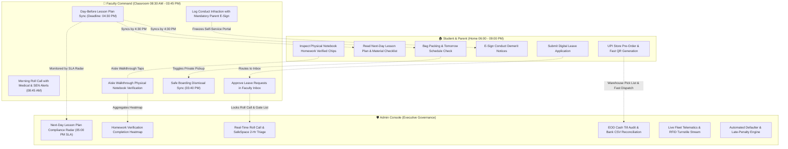

# Finkfold EdOS: Cross-Portal Coordination & Communication Protocol
## Master Relational Blueprint, Coordination Loops & Institutional Timing SLAs

**System Version**: 2.5 (Enterprise Multi-Campus Edition)  
**Target Institution**: Priyanka English Medium School & Trust Campuses  
**Effective Date**: Academic Year 2026–2027  
**Governance**: Trust Central Academic Council, Campus Principals & Student Welfare Committee  

---

## 🏛️ Foundational Operational Principle: The Physical-to-Digital Reality

In a real-world high school environment, **students are strictly prohibited from carrying or using smartphones during school hours (08:30 AM to 03:45 PM)**. 

Therefore, any educational portal that expects a student to "submit homework online during class" or "check their schedule on their phone in the classroom" fundamentally fails real-world school operations.

Finkfold EdOS is engineered around **The Reality-Grounded Coordination Principle**:
1. **The Home-to-School Handshake**: Students and parents interact with the portal **at home in the evening (06:00 PM – 09:00 PM)** to review tomorrow's timetable, read upcoming lesson objectives, pack specific books/geometry instruments, and check off teacher-verified homework.
2. **The In-Class Digital Verification**: During school hours, teachers use the **Faculty Mobile PWA / Tablet** to mark roll call, inspect physical notebooks, award merit points, check confidential health/SEN flags, and manage dismissal.
3. **The Executive Oversight Radar**: Campus administrators monitor live institutional telemetry (timely lesson plan submission by 4:30 PM, morning roll call completion by 08:50 AM, till reconciliation by 05:00 PM) to ensure zero drop in teaching and operational quality.

---

## 🧭 The 12 Cross-Portal Relational Rules

---

### RULE 1: The "Day-Before" Academic Sync (Timetables & Lesson Plans)

#### 1. The Operational Constraint:
Students pack their school bags between **07:00 PM and 08:30 PM** the night before. If a teacher posts a lesson plan or room change tomorrow morning at 08:30 AM, the student is already at school with the wrong books.

#### 2. The Triangulated Coordination Loop:
* **The Faculty Duty (By 04:30 PM Today)**:
  - Subject teachers must publish tomorrow's lesson plan, core objectives, and **Required Student Materials to Pack** (e.g. *Class 10-A Math: Advanced Quadratic Equations — Pack Long Ruled Notebook, Geometry Box, Math Vol. 2*) by **04:30 PM**.
  - Clicking **"Sync to Student Evening View"** in the Collaborative Unit Planner pushes the lesson plan to the master student timetable.
* **The Student Experience (06:00 PM – 09:00 PM at Home)**:
  - When the student logs in at home, the **"Upcoming Class / Tomorrow's Schedule"** card dynamically showcases tomorrow morning's Period 1.
  - Clicking **"View Lesson Plan & Packing Guide →"** displays the exact materials checklist, ensuring the student packs the correct textbooks, lab aprons, or instruments tonight.
* **The Admin Oversight (05:00 PM SLA Radar)**:
  - The Admin Overview Dashboard features the **"Lesson Plan Compliance Radar"**.
  - If any homeroom teacher fails to sync tomorrow's lesson plan by 05:00 PM, the Academic Coordinator receives an amber warning flag, guaranteeing that students are never left guessing.

---

### RULE 2: The Physical-to-Digital Homework Loop (In-Class Verification)

#### 1. The Operational Constraint:
Students do not type math derivations or language essays into an online form during the day; **homework is written by hand in physical paper notebooks**. The portal must bridge physical classroom verification with digital parent tracking.

#### 2. The Triangulated Coordination Loop:
* **The Faculty Duty (Assigning)**:
  - The teacher publishes the assignment before 04:00 PM (e.g. *Exercise 4.3 Questions 1 to 10 in Math Vol. 1 Notebook*).
* **The Student Experience (At Home)**:
  - The student views the amber chip: **"Assigned & Due Tomorrow (In Physical Notebook)"**. The student solves the problems by hand in their notebook.
* **The Faculty Duty (In-Class Aisle Walkthrough)**:
  - The next morning during Period 1, the teacher walks down the aisles inspecting open student notebooks.
  - On their smartphone or tablet, the teacher opens **"Verify Notebooks (Aisle Walkthrough)"**.
  - In 45 seconds, the teacher taps student names: `✓ Verified & Completed`, `~ Incomplete`, or `✗ Missing`.
* **The Cross-Portal Update**:
  - The moment the teacher taps "Save Verification", the Student Portal updates immediately:
    - Amber turns into Green: **"Checked & Verified by Teacher (Mrs. Priyanka Devi on Sep 20)"**.
    - Parents receive an automated WhatsApp confirmation: *"Math homework verified by Mrs. Priyanka Devi."*
* **The Admin Oversight**:
  - The Admin Dashboard features the **"Homework Completion Heatmap"**, alerting the Principal if a particular class has an abnormally high incomplete rate (>30%), prompting academic counseling.

---

### RULE 3: The Triangulated Leave & On-Duty (OD) Protocol

#### 1. The Operational Constraint:
A student's absence affects the morning roll-call register, the main gate security manifest, and the parent's safety peace of mind.

#### 2. The Triangulated Coordination Loop:
* **The Parent Action**:
  - Parent submits a digital leave request on the Student Portal (e.g., *Viral Fever — 2 Days Medical Leave* with doctor's prescription attached).
* **The Faculty Action**:
  - The request lands in the Class Teacher's **Digital Leave & OD Approval Inbox** on `/portal/faculty`. The teacher clicks **"Approve"**.
* **The Automated Multi-Portal Cascades**:
  - **To the Morning Roll Call**: The next morning, the teacher's roll-call toggle for that student is **automatically locked to "Approved Leave"** (blue badge). The teacher cannot accidentally mark them unexcused absent.
  - **To Gate Security**: The student is removed from the "Expected at Main Gate" morning manifest, preventing false "Missing Student" alarms.
  - **To the Parent**: An automated WhatsApp confirmation is dispatched: *"Medical leave for Rahul (Grade 10-A) approved by Class Teacher."*

---

### RULE 4: Disciplinary E-Signature & Self-Service Portal Freeze

#### 1. The Operational Constraint:
When a student commits a serious behavioral infraction (fighting, property damage, chronic bunking), students frequently hide paper diary notes from their parents.

#### 2. The Triangulated Coordination Loop:
* **The Faculty Action**:
  - The teacher logs the demerit on `/portal/faculty/conduct` (e.g. *-10 Demerits for Fighting in Corridor*) and checks **"Require Mandatory Guardian Digital E-Sign"**.
* **The System Action**:
  - The Student Portal is **immediately frozen**. Discretionary self-service features (Campus Uniform/Book Store ordering, Electives & Club Bidding, Out-Pass requests) are locked out.
  - A prominent banner appears: *"Disciplinary Notice: Action Required by Parent."*
* **The Parent Action**:
  - The parent receives an urgent WhatsApp notification with a direct verification link.
  - The parent logs in, reviews the incident report, timestamp, and teacher remarks, and clicks **"Sign & Acknowledge Infraction"**, which records an immutable cryptographic signature hash (`parent_signature_hash`).
* **The Cross-Portal Release**:
  - Once signed, the Student Portal self-service features automatically unlock.
  - The Admin **SafeSpace & Conduct Dashboard** clears the incident from the pending queue, maintaining a bulletproof legal audit trail that the parent was formally informed.

---

### RULE 5: Store Fulfillment & "Zero-Queue" Lunch Pickup Logistics

#### 1. The Operational Constraint:
Students have a short 30-minute lunch break. If 200 students stand in a chaotic queue to purchase textbooks, uniforms, or stationery, they miss their lunch.

#### 2. The Triangulated Coordination Loop:
* **The Parent Action**:
  - Parent orders the Class 10 Textbook Bundle or Uniform Polo on the Student Portal and pays instantly via dynamic UPI QR code.
* **The Admin Store Action**:
  - The order appears in the Campus Storekeeper's **"Pick & Pack" Dashboard** (`/portal/admin/store-fulfillment`).
  - The storekeeper packs the items into a sealed student bag, affixes the order label, and scans the barcode.
* **The Student Experience**:
  - The Student Portal instantly generates a green **"Ready for Lunch-Break Pickup" QR Code** (`QR-STORE-ORD-xxx`).
  - During lunch break, the student walks up to Counter 2, flashes the QR code, grabs their pre-packed bag, and walks away in 10 seconds with zero line waiting.

---

### RULE 6: The "Safe Boarding" Dismissal Sync (03:40 PM)

#### 1. The Operational Constraint:
At 03:45 PM, 1,000 students exit classrooms simultaneously. If a parent decides to pick up their child personally by car but the school bus driver waits 15 minutes searching for the child, the entire transport network is delayed.

#### 2. The Triangulated Coordination Loop:
* **The Parent Action (Before 03:30 PM)**:
  - If a parent is picking up their child personally, they open `/portal/student/transport` and toggle **"Private Pickup Today"**.
* **The Faculty Action (At 03:40 PM)**:
  - The homeroom teacher opens the **"Safe Boarding Dismissal View"** on `/portal/faculty`.
  - The roster dynamically updates: *"Kiran Kumar — Private Pickup (Do not send to Bus #04)"*.
* **The Transport & Gate Action**:
  - The driver's manifest for Bus #04 automatically drops the student, allowing the bus to depart on schedule without delay.
  - When the child exits through the main gate with their parent, the security turnstile logs the exit, completing the daily safety loop.

---

### RULE 7: Real-Time In-School Infirmary & Medical Alert Triangulation

#### 1. The Operational Constraint:
If a child suffers an asthma attack, fever, or sports injury at 11:00 AM, the teacher, the nurse, the parent, and the physical education coach must all have synchronized medical data.

#### 2. The Triangulated Coordination Loop:
* **The Health Vault Linkage**:
  - When a parent logs a chronic condition or allergy in `/portal/student/health` (e.g., *Severe Peanut Anaphylaxis - carries EpiPen*), a high-visibility **Medical Alert 🩺** permanently attaches to the student's profile across all teacher roll-call rosters and cafeteria menus.
* **The Nurse Clinic Action**:
  - When the child visits the campus infirmary, the nurse logs temperature, symptoms, and administered medication (e.g. *Paracetamol 250mg syrup, 45 mins rest*).
* **The Cross-Portal Notification**:
  - An emergency alert is dispatched to the parent's phone.
  - The homeroom teacher's screen updates to show: *"Currently in Campus Infirmary (Bed #2)"*, so the teacher does not report the student missing from class.

---

### RULE 8: Regulated Office Hours & Queue-Free PTM Slot Booking

#### 1. The Operational Constraint:
Teachers teach all day and have families in the evening. Parents calling personal mobile numbers at 09:30 PM burns out faculty. Conversely, traditional PTMs result in parents waiting 2 hours in hallway lines.

#### 2. The Triangulated Coordination Loop:
* **Regulated Office Hours (03:45 PM – 05:00 PM)**:
  - Parent-teacher chat is open strictly during institutional office hours. Messages submitted after 05:00 PM are automatically placed in a scheduled queue and delivered the next school day at 03:45 PM.
* **10-Minute PTM Reservation Slots**:
  - PTM dates feature pre-configured 10-minute consultation slots.
  - Parents reserve their preferred slot on the Student Portal.
  - The slot locks on the teacher's schedule. On PTM day, the parent arrives 5 minutes prior and walks directly into the conference with zero wait time.

---

### RULE 9: Automated Fee Defaulter Recovery & Examination Gate Release

#### 1. The Operational Constraint:
Manual fee follow-ups via phone calls are uncomfortable for clerks and humiliating for students.

#### 2. The Triangulated Coordination Loop:
* **The Automated Engine**:
  - On the 11th of each month, the Admin Late Penalty Engine applies the pre-configured rule (₹50/day late fee) to outstanding accounts.
* **The Omnichannel Reminder**:
  - The system dispatches an automated WhatsApp notice to the parent with an itemized breakdown and a **Dynamic UPI Deep Link** with the exact amount and branch bank account pre-filled.
* **The Instant Clearance Release**:
  - The moment the parent pays via UPI, the bank UTR reconciles with `fee_transactions`.
  - The Student Portal immediately releases the official **Section 80C Fee Tax Certificate** and unlocks examination report cards and hall ticket downloads.

---

### RULE 10: Digital Gate Out-Pass & Security Perimeter Turnstile Check

#### 1. The Operational Constraint:
A hostel student or day student leaving early for a medical appointment must have verified guardian authorization before security allows them through the campus perimeter.

#### 2. The Triangulated Coordination Loop:
* **The Request**: Student submits out-pass details (companion name, departure time, return time) on `/portal/student/outpass`.
* **The Multi-Stage Approval**: Parent confirms via WhatsApp OTP -> Hostel Warden / Class Teacher signs off in the faculty portal.
* **The Turnstile Gatepass QR**:
  - A dynamic, tamper-proof **Gatepass QR Code** (`QR-GATE-OP-xxx`) appears on the student's screen.
  - Security guards scan the QR at the turnstile gate using their tablet. The gate turnstile releases, logs the exact exit timestamp, and alerts the parent that the child has safely departed.

---

### RULE 11: Lost & Found Desk-Delivery Workflow

#### 1. The Operational Constraint:
Children misplace water bottles, jackets, and geometry boxes daily. Traditional cardboard lost-and-found boxes result in permanent loss.

#### 2. The Triangulated Coordination Loop:
* **Logging the Item**: Cleaning staff or teachers find an item, take a photo, and log it in `/portal/faculty/lost-found` with the exact locker bin number.
* **Browsing & Claiming**: Parents and students browse the digital Lost & Found catalog on `/portal/student/lost-found`. When they identify their item, they click **"Claim This Item"** and enter a unique identifying mark (e.g. *"Initials AK in ballpoint inside collar tag"*).
* **The Desk Delivery**: The caretaker verifies the mark and delivers the item directly to the student's homeroom desk the following morning.

---

### RULE 12: Inclusive Education & Confidential SEN Shield

#### 1. The Operational Constraint:
Students with diagnosed learning differences (Dyslexia, ADHD, Anxiety) need specialized accommodations, but public labeling creates social stigma among peers.

#### 2. The Triangulated Coordination Loop:
* **The Confidential Vault**: Special educators record psychologist-certified accommodations in the **SEN Confidential Vault** (`sen_student_profiles`).
* **The Discreet Teacher Star ⭐**: On teacher roll-call rosters and seating charts, a subtle yellow star ⭐ appears next to the student's name, visible **only to certified faculty**.
* **Actionable Classroom Directives**: Clicking the star reveals specific instructions (e.g., *"Do not force to read aloud; allow 15 extra minutes for exams; seat in front row"*).
* **Compliance Integration**: When the Admin Board Exam LOC Automator compiles candidates for CBSE/ICSE, it automatically imports the CWSN concessions code, ensuring the student receives their authorized scribe or extra time from the board.

---

## 📊 Summary Matrix: Cross-Portal Relational SLAs

| Operational Workflow | Initiator Portal | Intermediary Action | Terminal Cascade | Timing SLA |
| :--- | :--- | :--- | :--- | :---: |
| **Next-Day Lesson Prep** | Faculty (Curriculum Hub) | Admin Compliance Radar Checks | Student Portal Bag Packing Checklist | **04:30 PM Today** |
| **Homework Verification** | Student (Physical Notebook) | Faculty Aisle Walkthrough Check | Student Portal Green Chip & WhatsApp Push | **09:15 AM In-Class** |
| **Medical / OD Leave** | Parent (Student Portal) | Faculty Inbox 1-Tap Approval | Locks Roll Call & Main Gate Security Manifest | **< 2 Hours** |
| **Conduct Infraction** | Faculty (Conduct Ledger) | Parent E-Sign WhatsApp Notice | Unlocks Frozen Student Portal Features | **Same Day** |
| **Campus Store Order** | Parent (UPI Checkout) | Storekeeper Pick & Pack Barcode Scan | Student 10s Lunch Pickup QR Voucher | **Before 12:30 PM** |
| **Afternoon Dismissal** | Parent (Private Pickup Toggle) | Faculty Safe Boarding Roster Sync | Bus Manifest Excludes & Gate RFID Logs | **03:30 PM Cutoff** |
| **Clinic Trauma Log** | Nurse (Infirmary Desk) | Emergency WhatsApp to Parent | Teacher Roll Call Displays "In Clinic" | **Instant (< 60s)** |
| **Fee Defaulter Settlement** | Admin (Late Penalty Rule) | Parent UPI Link Payment | Unlocks Exam Hall Ticket & 80C Receipt | **Instant on UTR** |
| **Gate Out-Pass** | Student (Out-Pass Form) | Parent & Warden Digital Approval | Security Gate Scans Dynamic Exit QR | **< 30 Minutes** |

---

*Finkfold Educational Operating System (EdOS) — Built with pride for Priyanka English Medium School.*
