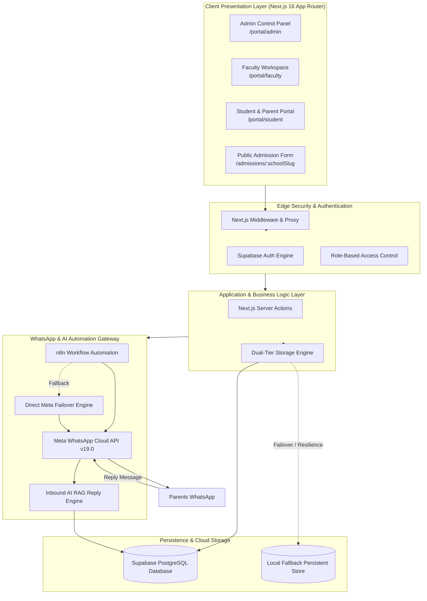

# Finkfold School Portal — Comprehensive Project Documentation & User Manual

**Version**: 2.0 (Enterprise Production Edition)  
**Target Institution**: Priyanka English Medium School & Finkfold ERP Partner Schools  
**Technology Base**: Next.js 16 (Turbopack) • React 19 • Supabase PostgreSQL • Meta WhatsApp Cloud API • n8n Automation Engine  

---

## Table of Contents
1. [Project Overview & Vision](#1-project-overview--vision)
2. [Technology Stack & System Architecture](#2-technology-stack--system-architecture)
3. [Automation & Real-World Working Process](#3-automation--real-world-working-process)
4. [Complete Feature Directory](#4-complete-feature-directory)
5. [Role-Based User Manual](#5-role-based-user-manual)
   - [5.1 School Administrator Manual](#51-school-administrator-manual)
   - [5.2 Faculty / Teacher Manual](#52-faculty--teacher-manual)
   - [5.3 Student & Parent Manual](#53-student--parent-manual)
6. [Database Schema & Security Architecture](#6-database-schema--security-architecture)
7. [Meta WhatsApp API & n8n Gateway Specs](#7-meta-whatsapp-api--n8n-gateway-specs)
8. [Troubleshooting, FAQs & Maintenance](#8-troubleshooting-faqs--maintenance)

---

## 1. Project Overview & Vision

### 1.1 The Problem It Solves
Traditional Indian schools face significant operational bottlenecks:
- **Low Parent App Adoption**: Legacy school mobile apps require downloading 50MB+ applications from the Google Play Store, creating accounts, and remembering credentials. Over 80% of parents fail to check them consistently.
- **Dead SMS Communication**: Traditional bulk SMS suffers from character limits, DLT registration friction, and carrier spam filtering (Truecaller/Android), leading to unopened rates exceeding 85%.
- **Manual Attendance & Diary Inefficiency**: Teachers waste 20–30 minutes daily scribbling notes into paper diaries and calling parents manually when children are absent.
- **Uncollected School Fees**: Schools routinely suffer from 15% to 30% overdue student fees due to lack of automated payment reminders and accountability.

### 1.2 The Finkfold Solution
Finkfold is a **WhatsApp-First Smart School Portal**. Instead of forcing parents to download another app, Finkfold bridges school operations directly with **Meta's Official WhatsApp Cloud Platform**:
- Instant WhatsApp alert delivered to parents within 3 seconds of a teacher taking roll call.
- Two-way communication: parents reply on WhatsApp, and notes appear in the teacher's portal.
- Dedicated web dashboards for **Administrators**, **Teachers**, and **Students/Parents**.
- Homework assignments, official circulars, digital admissions, and teacher scheduling all unified into a single cloud ecosystem.

---

## 2. Technology Stack & System Architecture



### Detailed Tech Stack Breakdown
- **Frontend Framework**: Next.js 16 (App Router, Turbopack, React 19 Server Components, Server Actions).
- **Styling Architecture**: Pure Vanilla CSS design tokens, modern typography (`Outfit` for titles, `Inter` for data), glassmorphic shells, responsive micro-animations.
- **Database & Auth**: Supabase PostgreSQL with Row Level Security (RLS), custom `app_role` enum (`super_admin`, `school_admin`, `teacher`, `parent`), and connection pooling.
- **Resilience Engine**: Custom dual-tier persistence layer (`homeworkStore.ts`, `circularsStore.ts`) providing zero-downtime operation with automatic Supabase-to-disk failover.
- **WhatsApp Cloud Integration**: Meta Graph API v19.0, WABA Account ID `1718429122911368`, Phone Number ID `1144602028740736`.
- **Workflow Automation**: n8n Cloud Webhooks (`https://finkfold.app.n8n.cloud/webhook/attendance`) with HMAC secret headers and direct Meta Graph fallback.

---

## 3. Automation & Real-World Working Process

### 3.1 Morning Attendance Roll Call Flow
```
[Teacher logs into /portal/faculty]
                  │
                  ▼
[Selects assigned class e.g. 10-A and clicks "Mark Roll Call"]
                  │
                  ▼
[All students start marked "Present" by default (Green toggle)]
                  │
                  ▼
[Teacher taps only the students who are absent (Toggles Red "Absent")]
                  │
                  ▼
[Teacher clicks "Submit Attendance Session"]
                  │
                  ▼
[Server Action: `submitAttendance.ts`]
  ├─ 1. Upserts attendance session & individual student records in DB
  ├─ 2. Deduplication check: filters out already-notified absentees
  ├─ 3. Dispatches Webhook to n8n with HMAC security signature
  └─ 4. If n8n times out, immediately triggers direct Meta Cloud API
                  │
                  ▼
[Within 3 seconds: Parent receives WhatsApp Message]
  "Dear Parent, your ward [Student Name] is marked absent on [Date].
   If this is an error, please reply to this message."
```

### 3.2 Late-Arrival Correction Flow (Deduplication Safeguard)
A frequent issue in schools is when a student arrives 30 minutes late with a parent after attendance was already taken:
1. Teacher re-opens the session (now labeled with a green `✓ Completed` badge) and clicks **"✏️ Edit Attendance / Late Arrival"**.
2. Teacher toggles the latecomer from **"Absent" &rarr; "Present"**.
3. Upon submission, the deduplication engine in `submitAttendance.ts` verifies:
   - Previously absent students who remain absent are **skipped** (no duplicate WhatsApp alert).
   - Only the corrected student triggers an event (`correction_to_present`).
   - Meta failover ensures the absence template `finkfold_priyanka` is never sent to a student marked present.

### 3.3 Two-Way Parent Inbound Reply Flow
1. A parent replies to the absence message on WhatsApp (e.g., *"Kiran has a mild fever today. He will attend tomorrow."*).
2. Meta forwards the webhook to the inbound listener (`/api/whatsapp-reply` or n8n RAG bot).
3. The message is stored in `parent_reply_log` and flagged with an unread badge in the Teacher's and Admin's portal.
4. The teacher reviews the note in **Parent Messages (`/portal/faculty/messages`)** and clicks **"✓ Mark Handled"**.

---

## 4. Complete Feature Directory

| Category | Feature Name | Description |
| :--- | :--- | :--- |
| **Attendance** | One-Tap Class Roll Call | Fast roll call with pre-filled Present status, absentee counters, and notes. |
| | Late-Arrival Edit Mode | Correct student attendance without triggering duplicate WhatsApp messages. |
| | Monthly Calendar Matrix | Monthly visual breakdown with present/absent color codes and streak tallies. |
| **Communications** | Official WhatsApp Gateway | Meta Cloud API integration sending verified templates directly to parent phones. |
| | Bulletproof Direct Failover | If the n8n automation pipeline is inactive, the portal fails over directly to Meta Graph API. |
| | Parent Messages Inbox | Centralized view of parent WhatsApp responses with read/handled state tracking. |
| **Academic** | Homework Hub | Class-specific homework assignment with quick subject pills and due date presets. |
| | School Circulars Board | Urgent and general notice publishing board with categories and publish dates. |
| | Timetable & Schedule | Period-by-period class timetable breakdown for faculty and students. |
| **Administration** | Executive Dashboard | High-level metrics: total students, classes marked today, WhatsApp alerts count. |
| | Student Registry | Complete student records with roll numbers, parent contacts, and TC exit workflows. |
| | Bulk CSV Student Import | Onboard entire classes and hundreds of students in seconds via CSV upload. |
| | Digital Admissions Queue | Public online application form with admin review, verification, and auto-enrollment. |
| | Staff Management Grid | Teacher employee records, class teacher designations, and subject allocations. |
| | Year-End Promotions | Batch promotion tool moving students from Grade $N$ to $N+1$ across academic years. |
| | WhatsApp Audit Log | Live message delivery log with real-time Meta delivery statuses. |

---

## 5. Role-Based User Manual

---

### 5.1 School Administrator Manual

#### 1. Logging In
- Navigate to `/login`.
- Enter your Admin email and password.
- You will be automatically directed to `/portal/admin`.

#### 2. Monitoring Morning Operations (Executive Overview)
- The top KPI strip shows:
  - **Total Students**: Active enrolled students in the school.
  - **Classes**: Total classes in the system.
  - **Pending Roll Calls**: Shows how many teachers haven't taken attendance yet.
  - **WhatsApp Sent**: Real-time counter of WhatsApp alerts dispatched today.
- In the **Class Attendance Status** table, monitor which classes have completed roll call. You can click **"Mark / Edit"** on any class to review or take attendance on behalf of an absent teacher.

#### 3. Publishing School Circulars (`/portal/admin/circulars`)
1. Click **"School Circulars"** in the sidebar.
2. Click the **"📢 Publish Circular"** button.
3. Fill in:
   - **Title**: E.g., *"Annual Sports Day 2026 Registration"*.
   - **Category**: Select from `Event`, `Exam`, `Library`, `Sports`, `Finance`, or `General`.
   - **Publish Date**: Defaults to today.
   - **Mark as Urgent**: Check this box if the notice requires immediate parent attention (pins to the top with a yellow border).
   - **Description**: Detailed guidelines, dates, and instructions.
4. Click **"Publish Notice"**. The circular appears immediately on all student and parent dashboards.

#### 4. Managing Student Admissions (`/portal/admin/admissions`)
- Share your school's branded public admission link: `/admissions/priyanka-em-school`.
- Prospective parents fill out student details, previous school history, and contact numbers.
- In the Admin Portal under **Admissions**:
  - Review submitted applications.
  - Click **"Approve & Enroll"**: The system automatically generates an admission number and enrolls the student into the designated class.
  - Click **"Reject"** if seats are filled or criteria are not met.

#### 5. Managing Staff & Class Allocation (`/portal/admin/staff`)
- **Add New Teacher**: Click **"+ Add Staff Member"**, provide full name, employee code, phone number, and assign primary subjects.
- **Allocate Classes**: Use the **Class Allocation Grid** to link teachers to specific classes (e.g., assigning Mrs. Sunitha as Class Teacher for 10-A).

#### 6. Student Registry & Bulk CSV Import (`/portal/admin/students`)
- **View Directory**: Search and filter students by class, roll number, or name.
- **Bulk Import**: Click **"Import CSV"**, download the sample template, upload your school's student spreadsheet, and click **"Process Import"** to populate hundreds of students in seconds.
- **Mark Left / Transfer Certificate (TC)**: When a student leaves the school, open their profile, click **"Mark Left"**, select the reason (`tc_issued`, `transferred`, `passed_out`), and confirm. Their historic attendance records are preserved.

---

### 5.2 Faculty / Teacher Manual

#### 1. Daily Roll Call Procedure (`/portal/faculty`)
1. Log in at `/login` with your teacher credentials.
2. On your dashboard, you will see all classes assigned to you.
3. Unmarked classes show a yellow **"Pending"** badge. Click **"Mark Roll Call &rarr;"**.
4. The attendance roll lists all students in that class. All students are pre-set to **"Present" (Green)**.
5. Tap only the students who are absent to toggle them to **"Absent" (Red)**.
6. Click **"Submit Attendance Session"**.
7. The page reloads showing **"✓ Completed"**, and absence alerts are dispatched to parents' WhatsApp immediately.

#### 2. Handling Late Arrivals (`Late-Arrival Edit`)
1. If an absent student arrives late, open the marked class attendance by clicking **"✓ Completed — View / Edit Roll"**.
2. Click the **"✏️ Edit Attendance / Late Arrival"** button.
3. Switch that student from **"Absent" &rarr; "Present"**.
4. Click **"Save Changes"**. The student is marked present, and no duplicate absence alerts are sent to the rest of the class.

#### 3. Assigning Daily Homework (`/portal/faculty/homework`)
1. Click **"Assign Homework"** in the sidebar.
2. Select the target class using the top tabs (e.g., *Class 10-A*).
3. Select the subject using the quick pills (`Mathematics`, `Science`, `English`, etc.) or type a custom subject.
4. Choose the due date using presets (*"Tomorrow"*, *"In 2 Days"*, *"In 1 Week"*) or the date picker.
5. Enter instructions (e.g., *"Solve Exercise 4.3 questions 1 to 10 in homework notebook"*).
6. Click **"📝 Publish Homework"**. Students immediately see the assignment in their portal.

#### 4. Checking Parent Replies (`/portal/faculty/messages`)
- Click **"Parent Messages"** in the sidebar.
- Read messages sent by parents from WhatsApp (e.g., leave requests or sickness notes).
- Once read or noted, click **"Mark Handled"** to clear the notification badge.

---

### 5.3 Student & Parent Manual

#### 1. Logging In
- Navigate to `/login`.
- Enter the student credentials provided by the school (e.g., `priy.2026.001@priyanka.school` with password `Student@123`).
- You will be taken directly to the **Student Dashboard (`/portal/student`)**.

#### 2. Viewing Attendance
- The dashboard displays your overall attendance percentage, days present, and days absent.
- The interactive monthly calendar shows green for present days and red for absent days.

#### 3. Checking Homework Assignments (`/portal/student/homework`)
- Click **"Homework"** in the sidebar.
- Active assignments for your class are displayed with:
  - Subject name.
  - Due date badge (color-coded: Red for *Tomorrow/Today*, Yellow for *2 days*, Blue for *3+ days*).
  - Clear task instructions written by your class teacher.

#### 4. Reading School Circulars (`/portal/student/circulars`)
- Click **"Circulars"** in the sidebar.
- Read important school notices, exam timetables, event schedules, and fee reminders.
- Urgent notices appear highlighted at the top with a bell icon (`🔔 Urgent`).

#### 5. Class Timetable (`/portal/student/timetable`)
- Check your daily class schedule, period timings, and assigned subjects from Monday through Saturday.

---

## 6. Database Schema & Security Architecture

The system runs on Supabase PostgreSQL with strict Row Level Security (RLS) and custom enum constraints:

```sql
-- 1. Profiles (RBAC)
CREATE TABLE public.profiles (
  id uuid PRIMARY KEY REFERENCES auth.users(id),
  school_id uuid NOT NULL REFERENCES public.schools(id),
  full_name text NOT NULL,
  role app_role NOT NULL DEFAULT 'teacher',
  phone text,
  employee_code text,
  is_active boolean NOT NULL DEFAULT true
);

-- 2. Classes
CREATE TABLE public.classes (
  id uuid PRIMARY KEY DEFAULT gen_random_uuid(),
  school_id uuid NOT NULL REFERENCES public.schools(id),
  name text NOT NULL,
  section text NOT NULL,
  academic_year text NOT NULL DEFAULT '2026-2027'
);

-- 3. Students
CREATE TABLE public.students (
  id uuid PRIMARY KEY DEFAULT gen_random_uuid(),
  school_id uuid NOT NULL REFERENCES public.schools(id),
  class_id uuid NOT NULL REFERENCES public.classes(id),
  admission_no text NOT NULL UNIQUE,
  full_name text NOT NULL,
  roll_no integer NOT NULL,
  parent_name text,
  parent_phone text,
  is_active boolean NOT NULL DEFAULT true,
  consent_whatsapp boolean NOT NULL DEFAULT true
);

-- 4. Attendance Sessions & Records
CREATE TABLE public.attendance_sessions (
  id uuid PRIMARY KEY DEFAULT gen_random_uuid(),
  school_id uuid NOT NULL REFERENCES public.schools(id),
  class_id uuid NOT NULL REFERENCES public.classes(id),
  attendance_date date NOT NULL,
  marked_by uuid NOT NULL REFERENCES public.profiles(id)
);

CREATE TABLE public.attendance_records (
  id uuid PRIMARY KEY DEFAULT gen_random_uuid(),
  session_id uuid NOT NULL REFERENCES public.attendance_sessions(id),
  student_id uuid NOT NULL REFERENCES public.students(id),
  status text NOT NULL CHECK (status IN ('present', 'absent')),
  note text
);

-- 5. WhatsApp Audit Log
CREATE TABLE public.whatsapp_notifications (
  id uuid PRIMARY KEY DEFAULT gen_random_uuid(),
  school_id uuid NOT NULL REFERENCES public.schools(id),
  session_id uuid NOT NULL REFERENCES public.attendance_sessions(id),
  student_id uuid NOT NULL REFERENCES public.students(id),
  attendance_date date NOT NULL,
  event_type text NOT NULL CHECK (event_type IN ('absent', 'correction_to_present')),
  parent_phone text NOT NULL,
  template_name text NOT NULL,
  status text NOT NULL DEFAULT 'pending',
  meta_message_id text,
  error_detail text,
  attempt_count integer DEFAULT 0,
  updated_at timestamp with time zone DEFAULT now()
);

-- 6. Homework Hub
CREATE TABLE public.homework (
  id uuid PRIMARY KEY DEFAULT gen_random_uuid(),
  school_id uuid NOT NULL REFERENCES public.schools(id) ON DELETE CASCADE,
  class_id uuid NOT NULL REFERENCES public.classes(id) ON DELETE CASCADE,
  subject text NOT NULL,
  task text NOT NULL,
  due_date date NOT NULL,
  assigned_by uuid REFERENCES public.profiles(id) ON DELETE SET NULL,
  created_at timestamp with time zone DEFAULT now()
);

-- 7. School Circulars
CREATE TABLE public.circulars (
  id uuid PRIMARY KEY DEFAULT gen_random_uuid(),
  school_id uuid NOT NULL REFERENCES public.schools(id) ON DELETE CASCADE,
  title text NOT NULL,
  category text NOT NULL DEFAULT 'General',
  urgent boolean NOT NULL DEFAULT false,
  description text NOT NULL,
  publish_date date NOT NULL DEFAULT CURRENT_DATE,
  posted_by uuid REFERENCES public.profiles(id) ON DELETE SET NULL,
  created_at timestamp with time zone DEFAULT now()
);
```

---

## 7. Meta WhatsApp API & n8n Gateway Specs

### Approved Message Template: `finkfold_priyanka`
- **Language**: `en` (English)
- **Category**: `UTILITY`
- **Body Text**:
  > *"Dear Parent, your ward {{1}} is marked absent on {{2}}."*
- **Variables**:
  - `{{1}}`: Student Full Name (e.g. *Kiran Kumar*)
  - `{{2}}`: Attendance Date (e.g. *2026-09-15*)

### Webhook Payload Schema (Sent from Portal to n8n / Meta)
```json
{
  "school_id": "s1701001-0000-4000-a000-000000000001",
  "session_id": "att-sess-uuid",
  "student_id": "stu-uuid",
  "student_name": "Arjun Murthy",
  "class_label": "10-A",
  "event_type": "absent",
  "attendance_date": "2026-09-15",
  "parent_phone": "919876543210",
  "parent_name": "Parent of Arjun Murthy",
  "template_name": "finkfold_priyanka"
}
```

---

## 8. Troubleshooting, FAQs & Maintenance

#### Q1: What happens if the school's internet or n8n cloud webhook is down?
**A**: The portal includes an **automatic failover engine**. If n8n does not respond or returns an error, the application automatically dispatches the WhatsApp template directly to Meta's Cloud API endpoint (`https://graph.facebook.com/v19.0/{PHONE_NUMBER_ID}/messages`). Attendance records are never lost.

#### Q2: What if a student comes late and the teacher edits the attendance? Will parents get two messages?
**A**: No. The system checks both historic session records and today's `whatsapp_notifications` table. If a student was already marked absent in the morning, their parent is **skipped**. Only newly marked absentees or corrections trigger updates.

#### Q3: Can parents reply to the WhatsApp message?
**A**: Yes. Parents can reply directly on WhatsApp with leave reasons or doctor notes. These messages are logged in `parent_reply_log` and immediately appear in the **Parent Messages** tab in the Faculty and Admin portals.

#### Q4: How are new teachers or students added mid-year?
**A**:
- For **Teachers**: Go to `/portal/admin/staff` and click **"+ Add Staff Member"**.
- For **Students**: Go to `/portal/admin/students` and either add a single student or upload a CSV file.
- For **Admissions**: Prospective parents fill out the online admission form at `/admissions/priyanka-em-school`, and the admin clicks **"Approve & Enroll"**.

---

*Documentation compiled and maintained by Finkfold Technologies Engineering Team.*
