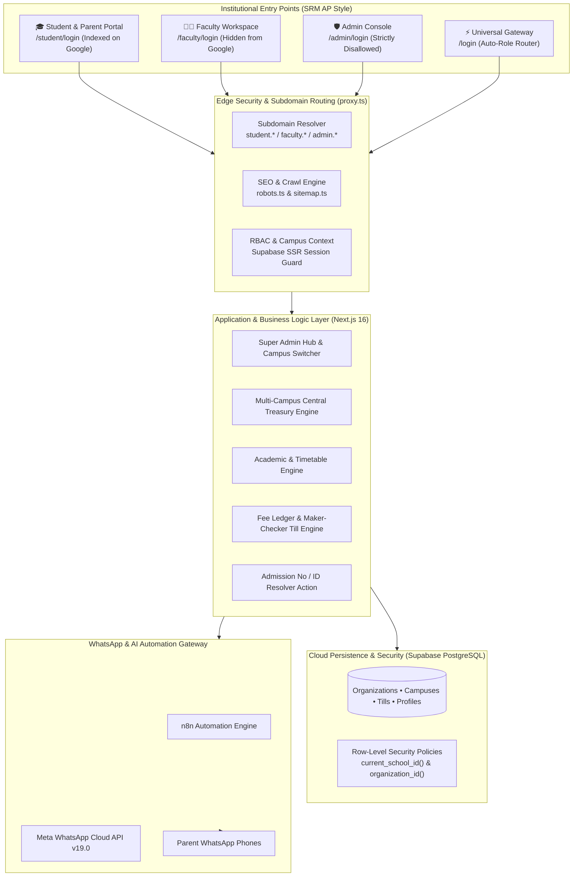

# Finkfold Educational Operating System (EdOS) — Master Project Documentation

**System Version**: 2.5 (Enterprise Multi-Campus Edition)  
**Target Institution**: Priyanka English Medium School & Trust Multi-Branch Campuses  
**Technology Base**: Next.js 16 (Turbopack) • React 19 • Supabase PostgreSQL • Meta WhatsApp Cloud API • n8n Automation Engine  
**Last Updated**: September 2026  

---

## Executive Summary & System Overview

**Finkfold** is an Autonomous, AI-Augmented Educational Operating System (EdOS) designed to replace legacy educational ERPs (e.g., Fedena, PS Labs) with an event-driven, multi-tenant cloud platform.

### Core Problems Solved
1. **Multi-Campus Multi-Tenant Scale**: Eliminates fragmented spreadsheets across 3+ physical campuses (Fathekhan Pet Main, Gandhi Nagar, Haranathpuram) through unified organization-level governance and granular Row-Level Security (RLS).
2. **Cash Leakage & Trust Deficit**: Replaces unmonitored cash handling with **Maker-Checker End-Of-Day (EOD) Cash Tills**, dynamic UPI QR routing directly into branch bank accounts, and daily automated financial audits.
3. **Low Digital Literacy**: Solves the 80%+ failure rate of traditional mobile apps by delivering attendance alerts, absence reason buttons, and fee receipts directly via **Meta WhatsApp Cloud Platform** in vernacular language.
4. **Institutional Portal Segmentation**: Replaces generic role-picking login screens with dedicated institutional portals modeled after premier universities (like SRM AP `student.srmap.edu.in`), where the **Student Portal** is indexed on Google while **Faculty** and **Admin Consoles** remain strictly private and hidden from search engines.

---

## System Architecture & Technology Stack



### Detailed Tech Stack Breakdown
* **Frontend Framework**: Next.js 16.3.5 (App Router, Turbopack, React 19 Server Components, Server Actions).
* **Styling Architecture**: Tailored Vanilla CSS design system with HSL design tokens, modern typography (`Outfit` for institutional branding, `Inter` for tabular data), glassmorphism, responsive data grids.
* **Database & Auth**: Supabase PostgreSQL with custom enums (`app_role`: `super_admin`, `school_admin`, `teacher`, `parent`), Foreign Key cascades, and granular Row Level Security (RLS).
* **Multi-Campus Context Routing**: Custom Next.js 16 `proxy.ts` propagating active campus cookies (`finkfold_active_school`), subdomains (`student.priyanka.school`), and downstream headers (`x-school-id`).
* **WhatsApp Cloud Platform**: Meta Graph API v19.0 (WABA Account ID `1718429122911368`, Phone Number ID `1144602028740736`).
* **Automation Workflow**: n8n Cloud Webhooks (`https://finkfold.app.n8n.cloud/webhook/attendance`) with HMAC SHA-256 validation and direct Meta Graph failover.

---

## Dedicated Institutional Portals & SEO Isolation

Unlike legacy portals that force all users onto a single generic login page with confusing role checkboxes, Finkfold EdOS provides **dedicated, specialized institutional gateways**:

| Portal | URL Route | Subdomain Route | Google Search (SEO) | Supported Login ID | Landing Workspace |
| :--- | :--- | :--- | :--- | :--- | :--- |
| **🎓 Student & Parent Portal** | `/student/login` | `student.priyanka.school` | **Indexed** (`index, follow`) | **Admission Number** (e.g. `PRIY-2026-001`, `001`) or Email | `/portal/student` |
| **👨‍🏫 Faculty & Staff Workspace** | `/faculty/login` | `faculty.priyanka.school` | **Hidden** (`noindex, nofollow`) | **Teacher Email / Employee ID** | `/portal/faculty` |
| **🛡️ Executive Admin Console** | `/admin/login` | `admin.priyanka.school` | **Strictly Disallowed** (`robots.txt` Disallow) | **Administrator Work Email** | `/portal/admin` (Super Admin & Branch Admin) |
| **⚡ Smart Universal Gateway** | `/login` | N/A | **Indexable Gateway** | Any email or student ID (auto-detects role without tabs) | Designated dashboard |

### 1. Student Portal Discoverability & Admission ID Login
- **Google Search Visibility**: The Student Portal at `/student/login` includes OpenGraph and rich meta tags (`Student & Parent Portal - Priyanka EM School`). When parents or students search Google for *"Priyanka School Student Portal"*, this portal ranks at the top.
- **Admission Number Resolver (`src/actions/studentAuth.ts`)**: Students often forget their email address. They can log in using their **Admission Number** (e.g., `PRIY-2026-001` or `001`) or their registered phone number. The server automatically maps it to their secure auth identity.

### 2. Search Engine Privacy for Faculty & Admin
- **`src/app/robots.ts`**: Dynamically generates instructions for Googlebot and other web crawlers:
  - **Disallow**: `/admin/`, `/admin/*`, `/portal/admin/*`, `/faculty/`, `/faculty/*`, `/portal/faculty/*`, `/api/*`.
  - **Allow**: `/`, `/student/login`, `/portal/student/*`, `/about`, `/academics`, `/admissions`, `/contact`.
- **`src/app/sitemap.ts`**: Indexes public admissions and the Student Portal while completely omitting faculty and administrative endpoints.
- **Admin Clearance Gate**: If an unauthorized user (like a student or teacher) attempts to sign in on `/admin/login`, the security gate rejects the session with an explicit *"Access Denied: Administrative Credentials Required"* message.

---

## Multi-Campus EdOS Architecture & Treasury Engine

### 1. Multi-Tenant Data Model
* **Organizations (`organizations`)**: High-level trust entity (e.g., *Priyanka Educational Trust*).
* **Campuses (`schools`)**: Physical branches under the organization (e.g., *Main Campus*, *Gandhi Nagar Branch*, *Haranathpuram Branch*).
* **Bank Accounts (`bank_accounts`)**: Dedicated branch accounts with IFSC, virtual payment addresses (VPA), and branch routing flags.
* **Campus Profiles (`profiles`)**: Users mapped to schools with dual roles (`role`, `primary_role`, and array `roles` for multi-campus administrators).

### 2. Super Admin Campus Switcher (`src/components/BranchSwitcher.tsx`)
* Located permanently in the top navigation bar for Super Admins.
* Allows instantaneous switching between campuses with zero page reloads.
* Persists the active campus context in secure HTTP-only cookies (`finkfold_active_school`) and updates downstream database queries immediately.

### 3. Multi-Campus Central Treasury Dashboard (`/portal/admin/treasury`)
* **Consolidated Revenue Metrics**: Real-time aggregated fee collections across all branches, total pending dues, and active bank balances.
* **Branch-by-Branch Breakdown**: Comparative cards showing collected revenue, fee recovery rate, and pending balances for each individual branch.
* **Inter-Branch Fund Transfers**: Formalized transfer mechanism with debit/credit ledger tracking, reference numbers, and reason logging.
* **Branch Bank Accounts Directory**: Overview of all active institutional bank accounts and UPI VPAs.

### 4. Maker-Checker EOD Cash Tills (`cash_till_sessions`)
* Eliminates multi-branch cash collection discrepancies.
* **Maker (Front-desk cashier)**: Opens till in the morning, collects fees, and enters closing cash count at 5:00 PM.
* **Checker (Principal / Branch Admin)**: Physically audits currency denominations, records discrepancy notes (over/short), and formally closes the till session.

---

## Complete Database Schema Specification (78 Production Tables)

The Finkfold EdOS persistence layer is hosted on **Supabase PostgreSQL** with comprehensive **Row-Level Security (RLS)**, foreign key cascade integrity, and automated timestamps. The schema comprises **37 Foundational Core Tables** plus **41 Portal Ecosystem Expansion Tables** provisioned in `supabase/migrations/008_complete_portal_ecosystem_expansion.sql`.

### 1. Foundational Core Schema (37 Base Tables)

| Domain | Table Name | Primary Key | Key Foreign Keys / Relations | Purpose & Workflow |
| :--- | :--- | :--- | :--- | :--- |
| **Trust Multi-Tenancy** | `organizations` | `id` (uuid) | None (Top-level trust entity) | Multi-campus trust governance (e.g. Priyanka Educational Trust). |
| | `schools` | `id` (uuid) | `organization_id -> organizations(id)` | Individual physical branch campuses (Main, Gandhi Nagar, Haranathpuram). |
| | `academic_years` | `id` (uuid) | `school_id -> schools(id)` | Academic calendar session boundaries (e.g., 2025-2026, 2026-2027). |
| | `profiles` | `id` (uuid) | `school_id -> schools(id)` | Institutional users (Super Admin, School Admin, Teachers, Parents, Students). |
| **Classroom & Students** | `classes` | `id` (uuid) | `school_id -> schools(id)` | Grades and sections (e.g., Class 10-A, Class 6-B) with homeroom teachers. |
| | `teacher_classes` | `id` (uuid) | `teacher_id -> profiles(id)`, `class_id -> classes(id)` | Subject and period allocation matrix for teachers. |
| | `students` | `id` (uuid) | `school_id -> schools(id)`, `class_id -> classes(id)` | Master student registry with admission number, DOB, and parent details. |
| | `student_enrollments`| `id` (uuid) | `student_id -> students(id)`, `class_id -> classes(id)` | Historical academic term enrollment records. |
| | `student_promotions` | `id` (uuid) | `student_id -> students(id)`, `school_id -> schools(id)` | Year-end cohort promotion audit log. |
| | `pending_admissions` | `id` (uuid) | `school_id -> schools(id)` | Inbound prospective student inquiries and online admission forms. |
| **Academics & Tasks** | `subjects` | `id` (uuid) | `school_id -> schools(id)` | Subject catalog (Math, Science, English, etc.) with credit hours. |
| | `homework` | `id` (uuid) | `class_id -> classes(id)`, `subject_id -> subjects(id)` | Daily homework announcements, deadlines, and instructions. |
| | `circulars` | `id` (uuid) | `school_id -> schools(id)` | Official school circulars and administrative broadcast notices. |
| **Attendance & Alerts** | `attendance_sessions`| `id` (uuid) | `school_id -> schools(id)`, `class_id -> classes(id)` | Morning and afternoon roll-call session manifests. |
| | `attendance_records` | `id` (uuid) | `session_id -> attendance_sessions(id)`, `student_id` | Individual student present/absent states with timestamps. |
| | `whatsapp_notifications`| `id` (uuid)| `student_id -> students(id)` | Outbound Meta Cloud API message delivery audit log. |
| | `parent_reply_log` | `id` (uuid) | `student_id -> students(id)` | Inbound WhatsApp absence reason button clicks. |
| **Treasury & Fees** | `fee_structures` | `id` (uuid) | `school_id -> schools(id)` | Configured fee heads (Tuition, Transport, Exam, Lab, Library, Late Fee). |
| | `cash_drawers` | `id` (uuid) | `school_id -> schools(id)`, `cashier_id -> profiles(id)`| Front-desk EOD physical cash till sessions with maker-checker audit. |
| | `fee_transactions` | `id` (uuid) | `student_id -> students(id)`, `fee_structure_id` | Immutable fee collection receipts with payment modes (Cash, UPI, NEFT). |
| **Logistics & Health** | `student_transport_subscriptions` | `id` (uuid) | `student_id -> students(id)` | Bus route and stop allocations with GPS route linkages. |
| | `campus_store_orders`| `id` (uuid) | `student_id -> students(id)` | Uniform and textbook pre-orders with QR lunch pickup vouchers. |
| | `student_elective_bids`| `id` (uuid)| `student_id -> students(id)` | 2nd language preferences and capacity-limited club bidding. |
| | `digital_outpasses` | `id` (uuid) | `student_id -> students(id)` | Multi-stage approved gate passes with security exit QR codes. |
| | `support_tickets` | `id` (uuid) | `student_id -> students(id)` | Helpdesk tickets across transport, accounts, and academics with SLAs. |
| | `student_medical_records`| `id` (uuid)| `student_id -> students(id)` | Blood groups, allergies, emergency contacts, and chronic conditions. |
| | `infirmary_visit_logs`| `id` (uuid)| `student_id -> students(id)` | Chronological nurse visit log with symptoms and medications given. |
| | `lost_and_found_items`| `id` (uuid)| `school_id -> schools(id)` | Campus lost item catalog with photo uploads and recovery claims. |
| | `anonymous_grievance_reports`| `id` (uuid)| Cryptographic Token (Anonymous) | SafeSpace confidential reporting with 2-hour SLA response clock. |
| | `student_conduct_ledger`| `id` (uuid)| `student_id -> students(id)` | Demerit and merit infraction ledger with parent e-sign lock. |
| | `regulated_teacher_messages`| `id` (uuid)| `teacher_id -> profiles(id)`, `student_id` | Regulated office-hours messaging between parents and teachers. |
| | `ptm_booking_slots`| `id` (uuid) | `teacher_id -> profiles(id)` | Parent-Teacher Meeting slot booking with calendar locks. |
| | `student_digital_certificates`| `id` (uuid)| `student_id -> students(id)` | Auto-generated Bonafide and Section 80C fee tax exemption certificates. |
| | `external_achievements_dropbox`| `id` (uuid)| `student_id -> students(id)` | Student uploads for external awards, sports trophies, and Olympiads. |
| | `student_id_photo_submissions`| `id` (uuid)| `student_id -> students(id)` | White-background ID card photo compliance submissions. |
| | `student_leaves_and_od`| `id` (uuid)| `student_id -> students(id)` | Student leave applications and on-duty (OD) event approvals. |
| | `student_bank_refund_profiles`| `id` (uuid)| `student_id -> students(id)` | Verified parent bank details for graduation caution deposit refunds. |

---

### 2. Ecosystem Expansion Schema (41 Migration 008 Tables)

Provisioned in `supabase/migrations/008_complete_portal_ecosystem_expansion.sql`:

#### A. Faculty Academic Engine (13 Tables)
1. **`exam_assessments`**: Formal examination master with term boundaries and start/end dates.
2. **`student_exam_marks`**: Itemized exam marks with max marks, marks obtained, percentage, and AI remedial alert flags.
3. **`staff_leaves`**: Faculty leave requests (Casual, Sick, On-Duty, Maternity) with multi-stage approval status.
4. **`curriculum_unit_plans`**: NEP 2020 unit lesson plans with Bloom's taxonomy tags, learning objectives, and co-teacher sync.
5. **`student_essay_submissions`**: Subjective essay submissions with AI rubric evaluation and 1-tap voice feedback audio memos.
6. **`classroom_seating_layouts`**: Drag-and-drop seating matrix with pairing collision warnings and "Eyes on Me" device lock controls.
7. **`sen_student_profiles`**: Inclusive education confidential profiles with diagnosed learning disabilities, IEP goals, and educator assignments.
8. **`staff_biometric_punches`**: Daily biometric gate punches (punch in/out) with regularization reasons for late arrivals.
9. **`store_indent_requisitions`**: Teacher classroom supply requisitions (markers, paper, lab chemicals) with desk delivery manifests.
10. **`campus_maintenance_tickets`**: Classroom asset repair work orders (smartboards, ACs, electrical) with technician SLA countdowns.
11. **`student_group_projects`**: Team collaborative projects with student IDs (`text[]`), mentor teachers, and peer evaluation heatmaps.
12. **`faculty_relief_allocations`**: Daily substitution desk assigning free teachers to absent staff periods with clash prevention.
13. **`field_trip_manifests`**: Educational tour manifests with participating classes (`text[]`), student rosters, and first aid verification.

#### B. Admin Enterprise Operations (12 Tables)
14. **`admissions_leads`**: Prospective student CRM pipeline funnel (Inquiry → Tour → Documents → Interview → Admitted).
15. **`bank_reconciliation_records`**: Uploaded bank statement line items with UTR matching against `fee_transactions`.
16. **`store_inventory`**: Campus store item catalog with SKU, safety stock thresholds, and unit costs.
17. **`store_purchase_orders`**: Automated vendor re-order POs with vendor emails, itemized line items, and approval states.
18. **`fleet_vehicles`**: School bus fleet telematics registry with live GPS coordinates, speed, route numbers, and driver phone numbers.
19. **`rfid_turnstile_logs`**: Main perimeter gate card swipes stream with direction (`entry`/`exit`), gate ID, and unauthorized breach alerts.
20. **`recruitment_job_openings`**: Institutional vacancy postings (e.g. PGT Physics, TGT Math) with qualification requirements.
21. **`recruitment_applicants`**: Applicant Tracking System (ATS) candidate records with resume URLs, interview stages, and onboarding flags.
22. **`faculty_appraisal_dossiers`**: 360° faculty appraisal matrix with generated weighted score (25% Biometric, 35% Academic, 20% PTM, 20% Relief).
23. **`obe_learning_outcomes`**: NEP 2020 Course Outcomes (CO) mapped to Bloom's taxonomy cognitive levels.
24. **`obe_student_attainments`**: Individual student outcome attainment percentages with pedagogical intervention alerts.
25. **`omnichannel_broadcasts`**: Emergency waterfall broadcast studio with delivery channels (`text[]`: Push ➔ WhatsApp ➔ SMS).

#### C. Admin Level 1, 2 & 3 Advanced Modules (16 Tables)
26. **`certificate_templates`**: Print Room template studio with dynamic variables (`text[]`) for Study, Bonafide, and Loan estimates.
27. **`generated_admin_certificates`**: Tamper-proof institutional certificates with verification QR codes and variable data snapshots.
28. **`library_books`**: Media center catalog with ISBN, barcode, author, shelf location, and available copy counters.
29. **`library_loans`**: Book checkout ledger with due dates, return dates, overdue fines, and automatic fee ledger debit sync.
30. **`fee_late_penalty_rules`**: Configurable late fee rules (₹50/day after grace period) linked to active `academic_years`.
31. **`fee_defaulter_logs`**: Automated recovery tracker with overdue penalty calculations and pre-filled WhatsApp UPI links.
32. **`visitor_passes`**: Digital Visitor Management System (VMS) gate passes with photo, host staff approval, and live campus headcount.
33. **`timetable_constraints`**: AI timetable solver constraints (teacher max periods, room capacities, part-time availability).
34. **`class_timetable_slots`**: Conflict-free weekly master timetable slots with day of week, period number, teacher, and room.
35. **`board_loc_candidates`**: CBSE/State Board List of Candidates with 60-point pre-flight validation, identification marks, and subject codes (`text[]`).
36. **`staff_salary_structures`**: Faculty pay structures with basic pay, HRA, DA, EPF eligibility, and tax withholding brackets.
37. **`monthly_payroll_runs`**: Monthly campus payroll batches with total working days, gross payout, deductions, and locked status.
38. **`staff_monthly_payslips`**: Itemized digital payslips synced to Faculty HR Hub with basic pay, allowances, LOP, EPF, and net pay.
39. **`alumni_profiles`**: Directory of graduating students tracking Tier-1 higher education institutions, current employers, and mentorship status.
40. **`endowment_campaigns`**: Institutional fundraising campaigns with target goals, collected totals, and active deadlines.
41. **`alumni_donations`**: Alumni contributions with donor PAN numbers, UTRs, and Section 80G Tax Exemption receipts with verification QR.

---

### 3. Alterations to Existing Tables
- **`students`**: Enhanced with Government Compliance & Board LOC Demographics (`aadhaar_number`, `aadhaar_status`, `social_category`, `minority_group`, `bpl_ews_status`, `cwsn_disability`, `mother_tongue_code`, `medium_of_instruction`, `parent_annual_income_slab`, `previous_year_attendance_days`, `total_instructional_days`, `identification_mark_1`, `identification_mark_2`).
- **`student_conduct_ledger`**: Enhanced with Parent E-Signature Verification Lock (`parent_signed`, `parent_signed_at`, `parent_signature_hash`).
- **`fee_structures`**: Expanded category check constraint to include `'library_fine'`, `'late_fee'`, `'books_uniform'`, and `'digital_portal'`.
- **`pending_admissions`**: Enhanced with Admissions CRM pipeline funnel (`lead_source`, `pipeline_stage`, `tour_date`, `lead_score`, `counselor_notes`).

---

## Role-Based User Manuals

### 1. Super Admin Manual (Trust Chairman / Central Director)
* **Login URL**: `/admin/login`
* **Credentials**: `superadmin@priyanka.school` / `Admin@123`

#### Key Workflows:
1. **Multi-Campus Switching**:
   - Look at the top navigation bar. Click the **Campus Selector** dropdown.
   - Choose any branch (*Fathekhan Pet Main*, *Gandhi Nagar*, or *Haranathpuram*).
   - All statistics, student rosters, and fee ledgers instantly switch to the selected campus.
2. **Central Treasury & Financial Governance**:
   - In the sidebar, navigate to **Treasury**.
   - Review total trust revenue, collection efficiency %, and individual branch balances.
   - Click **Transfer Funds** to allocate operational capital between branches with automated ledger entries.
   - Access **Fee Structures** to view universal and branch-specific fee categories.

---

### 2. School / Branch Admin Manual (Principal / Headmaster)
* **Login URL**: `/admin/login`
* **Credentials**: `admin@priyanka.school` / `Teacher@123`
* **Design Architecture**: Unified Calm Mist (`#f8fafc`) canvas, pure white elevated cards (`bg-white border border-slate-200/80 shadow-sm`), soft pastel stat surfaces, quick-jump search pill, dynamic live date/telemetry topbar, and 4-tier categorized navigation sidebar.
* **Complete Dedicated Guide**: See [School & Branch Admin Portal User Manual](./admin_portal_user_manual.md) for full operational breakdown.

#### Key Enterprise & Foundational Modules (18 Core Capabilities Across 6 Operational Sections):

##### Section 1: Executive Intelligence & AI Forecasting
1. **AI Enrollment Forecasting & Lead CRM (`/portal/admin/admissions/crm`)**:
   - **Lead Conversion Funnel**: Kanban board tracking prospective parents (Lead → Campus Tour → Document Verification → Enrolled).
   - **Marketing ROI Tracker**: Correlates admission inquiries with "Referred By" campaign data to pinpoint highest revenue generating ad channels.
   - **Predictive Capacity Engine**: AI analyzes historical dropout and transfer rates, predicting empty seats for next year and automatically opening the waitlist when capacity crosses 95%.
2. **Multi-Campus Central Treasury & Tally-Sync (`/portal/admin/treasury`)**:
   - **1-Click Tally Export**: Maps all fee heads (Tuition, Transport, Uniforms) to standard ledger codes and generates ready-to-import Tally ERP9 / TallyPrime XML files.
   - **Automated Bank Reconciliation**: Uploads Trust bank statement (CSV) and automatically cross-matches UPI UTR numbers with 99.4% precision, flagging unmatched credits or bounced transactions.

##### Section 2: "Smart Campus" Logistics & Fleet Command
3. **E-Commerce Store Fulfillment & Pick-Pack Indent (`/portal/admin/store-fulfillment`)**:
   - **"Pick & Pack" Warehouse Dashboard**: Generates consolidated aisle-by-aisle warehouse manifests for paid uniform and book orders.
   - **1-Scan Barcode Dispatch**: Packs bags and scans barcodes to trigger automated "Ready for Pickup" WhatsApp messages to parents.
   - **Automated Vendor Re-ordering**: Automatically drafts and emails Purchase Order (PO) PDFs to suppliers when stock falls below 20 units.
4. **Live Fleet Radar & RFID Gate Control (`/portal/admin/fleet`)**:
   - **Live GPS Telematics Tower**: Real-time Google Maps telemetry overlay tracking all 15 school buses with speed and schedule adherence indicators.
   - **Turnstile / RFID Gate Sync**: Real-time stream of student and staff RFID swipes at campus gates, alerting on unauthorized exits or breaches.

##### Section 3: HR, Recruitment & Staff Appraisals
5. **Careers ATS & Recruitment Kanban (`/portal/admin/staff/recruitment`)**:
   - **Careers Portal Sync**: Ingests candidate applications from public website, AI parses resumes into qualification grids.
   - **Interview Kanban Board**: Pipeline tracking from Applied → Demo Class Scheduled → Hired.
   - **1-Click Onboarding**: Moving candidate to "Hired" automatically creates employee ID, faculty login, and biometric attendance credentials.
6. **360° Faculty Appraisal Matrix (`/portal/admin/staff/appraisals`)**:
   - **Mathematical Performance Dossier**: Weighted formula combining Biometric Punctuality (25%), Academic Impact (35%), Parent PTM Sentiment (20%), and Relief Period Cooperation (20%) for objective merit-based salary increments.

##### Section 4: Academic Governance & NEP 2020 Compliance
7. **NEP 2020 OBE Auditor (`/portal/admin/academics/obe`)**:
   - **Bloom's Taxonomy Heatmap**: Visual matrix tracking cognitive distribution (Remembering, Understanding, Applying, Analyzing, Evaluating, Creating) to ensure analytical learning over rote memorization.
   - **Curriculum Directives**: One-click coaching directives dispatched to Academic Coordinators for under-indexed cognitive areas.
8. **"SafeSpace" Grievance Crisis Triage Board (`/portal/admin/safespace`)**:
   - **Emergency Triage Queue**: High-priority feed accessible exclusively by Principal and Head Counselor.
   - **2-Hour Red Countdown SLA**: Critical self-harm or severe bullying triggers 2-hour intervention clock; escalates to Trust Chairman if unanswered.
   - **Secure Anonymous Reply**: Two-way encrypted dialogue directly to anonymous token (e.g. `SAFE-TOKEN-8819`).

##### Section 5: Campus Maintenance & Helpdesk Operations
9. **Estate & Facility Management Command (`/portal/admin/maintenance`)**:
   - **Maintenance Work Orders Board**: Live kanban queue assigning smartboard, plumbing, and electrical repairs to technicians with SLA tracking.
   - **Asset Depreciation Tracker**: Tracks serial numbers (e.g. Asset #4012); automatically flags assets requiring >4 repairs/year for replacement budget.
   - **Preventative Maintenance Alerts**: Scheduled calendar triggers for water tank cleaning, pest control, and elevator inspections.
10. **Omnichannel Waterfall Broadcast Studio (`/portal/admin/broadcast`)**:
    - **Waterfall Cascade Delivery Engine**: One-click broadcast attempting Push Notification → if unread after 5 mins → WhatsApp Message → fallback SMS.
    - **Live Delivery Funnel**: Real-time telemetry tracking sent, delivered, read, and fallback status across recipient cohorts.

##### Section 6: Foundational Campus Administration
11. **Student Registry & Bulk CSV Onboarding (`/portal/admin/students`, `/portal/admin/students/import`)**: Complete student roster with class/section filters, student 360° profile drawer, and high-speed CSV bulk upload engine with pre-flight validation.
12. **Class Management & Attendance Roll Call Oversight (`/portal/admin/classes`)**: Real-time morning roll call monitoring (Green `Marked` vs. Amber `Pending`), room numbers, student capacity gauges, and administrative attendance override.
13. **Staff Directory & Allocation Grid (`/portal/admin/staff`, `/portal/admin/staff/allocations`)**: Staff roster, 1-click teacher account provisioning, and interactive subject/period assignment grid with workload balancing.
14. **Academic Setup & Subjects Master (`/portal/admin/academics`)**: Academic year term boundary configuration and curriculum subject catalog with credit periods and NEP 2020 grading scales.
15. **Fee Counter & POS Cash Till Sessions (`/portal/admin/fees`)**: Fast student term fee intake, dynamic UPI QR generation, instant printable tax receipts, and Maker-Checker End-of-Day cash till audit locking.
16. **Year-End Academic Promotions (`/portal/admin/promotions`)**: Batch student promotion wizard migrating class cohorts to the next academic grade with pass/detain/TC filters and rollback protection.
17. **WhatsApp Notification Audit & Meta Telemetry (`/portal/admin/whatsapp`, `/portal/admin/whatsapp/setup`)**: Real-time delivery logs (`sent`, `delivered`, `read`, `failed`) and WABA phone ID status monitoring.
18. **Institutional Configuration & Campus Settings (`/portal/admin/settings`)**: School crest/branding, address, academic hours, roll call deadline rules, and administrator password management.

##### Section 7: Level 1 — Core Daily Admin (Must-Haves)
19. **Dynamic Certificate & Document Studio ("Print Room") (`/portal/admin/documents`)**: Drag-and-drop certificate engine auto-populating student variables (`{{student_name}}`, `{{admission_no}}`, `{{total_fees}}`) for Study, Bonafide, Character, and Bank Education Loan Fee Estimates with tamper-proof QR verification.
20. **Library & Media Center Console (`/portal/admin/library`)**: ISBN barcode inventory management, active lending tracking, and 7-day overdue auto-fine sync posting pending debits directly to the student central fee ledger.

##### Section 8: Level 2 — Workflow & Revenue Automation
21. **Automated Defaulter & Late-Penalty Engine (`/portal/admin/fees/defaulters`)**: Configurable late fees (₹50/day after the 10th), dynamic UPI deep links pre-filling outstanding amount, 1-click WhatsApp reminder broadcasts, and class recovery heatmaps.
22. **Digital Visitor Management System (VMS) & Gatepass (`/portal/admin/visitors`)**: Reception tablet check-in, host teacher approval workflow, thermal badge printing with cryptographic QR code, and real-time campus headcount telemetry for emergency evacuations.
23. **Government Compliance Exporter (UDISE+ & State Boards) (`/portal/admin/compliance/udise`)**: Demographic auto-compilation (Aadhaar, Social Category, Minority, CWSN, BPL/EWS) with pre-flight validation and 1-click MoE v3.4 JSON/DCF export for school code `28190400102`.

##### Section 9: Level 3 — Enterprise Intelligence & AI Operations
24. **AI-Powered Timetable & Clash-Resolution Engine (`/portal/admin/academics/timetable`)**: Constraint-based AI solver resolving teacher max periods, room capacities, part-time faculty availability, and subject quotas in <2s with 100% clash-free guarantee.
25. **Board Exam LOC (List of Candidates) Automator (`/portal/admin/academics/board-loc`)**: 60-point pre-flight validation scanning for missing mandatory physical identification marks, typos, and photo/signatures with inline discrepancy editor and official board CSV export.
26. **Automated Payroll & Statutory Deductions Engine (`/portal/admin/payroll`)**: Biometric punch and approved leave reconciliation, automated Loss of Pay (LOP), statutory EPF (12%), Professional Tax (PT ₹200), TDS, bulk payslip sync to Faculty HR Hub, and corporate bank transfer CSV export.
27. **Alumni Network & Endowment CRM (`/portal/admin/alumni`)**: Searchable directory tracking alumni at Tier-1 universities (IITs, NITs, AIIMS) and top tech firms, mentorship tracking, endowment campaigns, and Section 80G Tax Exemption receipt generator with verification QR code.

---

### 3. Faculty / Teacher Manual
* **Login URL**: `/faculty/login`
* **Credentials**: `teacher@priyanka.school` / `Teacher@123`

#### Key Workflows:
1. **Morning Roll Call Attendance**:
   - Open the **Faculty Workspace**. Select assigned class (e.g., *Class 10 - Section A*).
   - Tap **Present** or **Absent** for each student.
   - Click **Submit Attendance**.
   - **Automation**: The system instantly dispatches WhatsApp absence alerts with interactive reason buttons to parents within 3 seconds.
2. **Inbound Parent Messages**:
   - View parents' replies directly in the message center (e.g., *"Child has fever, will attend tomorrow"*).
   - Acknowledge or forward medical leave notes with one click.
3. **Homework & Diary Updates**:
   - Post daily subject homework with due dates and instructions.
   - Parents immediately see homework in their portal and WhatsApp notifications.
4. **Classroom Analytics**:
   - View attendance percentage trends, chronic absenteeism warnings, and high-performer logs.

---

### 4. Student & Parent Manual
* **Login URL**: `/student/login` (or `student.priyanka.school`)
* **Credentials**: `student@priyanka.school` (or `PRIY-2026-001`) / `Student@123`

#### Key Workflows:
1. **Easy Sign-in without Email**:
   - Enter your **Admission Number** (e.g., `PRIY-2026-001` or `001`) found on your school ID card or fee receipt.
   - Enter your password.
2. **Smart Transport & Commute Management (`/portal/student/transport`)**:
   - **Dynamic Route Subscription**: Browse bus routes and nearest stops with real-time pickup/drop times and term fee calculation (e.g. ₹4,800/term for Santhi Nagar Circle).
   - **Live Safe-Ride GPS Tracking**: Interactive map visualization displaying live vehicle speed (e.g. 34 km/h), distance, upcoming stop, and dynamic 7-minute ETA countdown.
   - **Digital Transit Boarding Pass**: High-visibility dynamic QR pass (`QR-BUS-PRIY-2026-001`). Scanning upon entering the bus logs ingress and triggers automated "Safe Boarding" WhatsApp notification.
   - **Daily Manifest Opt-Out ("Not taking bus today")**: Parents toggle when picking up personally, immediately updating the driver's manifest so the bus does not wait.

3. **Campus E-Commerce: Uniforms, Books & Supplies (`/portal/student/store`)**:
   - **Class Academic Kits**: Complete curriculum bundles (e.g. Class 10 kit: 14 textbooks, 10 notebooks, geometry instruments).
   - **Interactive Sizing Matrix**: Select chest sizes (28, 30, 32, 34, 36) and shoe sizes (4 to 9) with visual fit guide.
   - **Finkfold Reward Points Engine**: Students earn reward points for on-time tuition fee payments (150 Pts). Points can be redeemed at checkout for instant discounts.
   - **Zero-Queue Lunch-Break Pickup**: Generates digital QR voucher (`QR-STORE-ORD-xxx`). Once packed by the school storekeeper, students simply present the QR pass during lunch break to collect their ready-to-go kit.

4. **Academic Electives & Extracurricular Bidding (`/portal/student/electives`)**:
   - **Second Language Choice Filling**: Rank 1st, 2nd, and 3rd preferences (Sanskrit, Hindi, French) for automated capacity allocation.
   - **Capacity-Driven Club Bidding**: Live seat gauges (e.g. Robotics Lab 28/30 seats filled; Debate Club 25/25 seats filled with automated digital waitlist).
   - **Annual Event Registrations**: 1-click registration for Annual Sports Day (100m sprint, Relay, Long Jump) and District Science Olympiad.

5. **Digital Out-Pass & Mess Management (`/portal/student/outpass`)**:
   - **Out-Pass Request Engine**: Submit weekend or day leave with exit/return date, companion name, and reason.
   - **Multi-Tier Digital Approval Workflow**: Parent WhatsApp consent -> Hostel Warden sign-off -> Temporary Security Gate Exit QR Code (`QR-GATE-OP-xxx`).
   - **Weekly Nutri-Balanced Cafeteria Menu**: Full Monday to Sunday meal breakdown (Breakfast, Lunch, Evening Snacks, Dinner) with dietary tags.
   - **Dining Feedback & Special Poll**: Rate daily lunch hygiene/taste and cast votes for Friday's feast.

6. **AI-Driven Document Vault & Helpdesk ("Zero-Visit" Front Office) (`/portal/student/documents`)**:
   - **1-Click Auto-Generated Certificates**:
     - *Bonafide Student Certificate*: Complete with institutional crest, serial number, Principal's digital signature, and verification QR code.
     - *Section 80C Fee Paid Tax Exemption Certificate*: Itemized tuition breakdown with Trust PAN & TAN for parent Income Tax filing.
     - *Attendance Compliance Certificate*: Certified 94.2% attendance record for passports, visas, or scholarship applications.
   - **Structured Support Helpdesk**: Raise tickets across Transport, Accounts, Academics, and ID Card Correction with live SLA response countdown timers (e.g. 14h SLA remaining).

7. **Health, Diet & Medical Vault (`/portal/student/health`)**:
   - **Emergency Medical Card**: Blood group (B +ve), height, weight, chronic conditions, and emergency pediatrician contacts.
   - **Instant Faculty Allergy Warning**: Updating allergies immediately flags the student's profile on the faculty roll-call roster and infirmary records.
   - **Infirmary & Medication Log**: Real-time chronological timeline of nurse visits (symptoms, body temperature, medications administered like Paracetamol syrup, rest duration, and WhatsApp alert status).

8. **Fee Portal & Dynamic UPI Payment (`/portal/student/fees`)**:
   - Itemized fee dues for the term (Tuition, Transport, Examination, Books).
   - Scan **Dynamic UPI QR Code**: Opens Google Pay, PhonePe, or Paytm with the exact amount and branch bank account pre-filled.
   - Instant digital fee receipts download.

---

## Meta WhatsApp Automation & n8n Workflow

```
Teacher Submits Roll Call (8:45 AM)
         │
         ▼
Next.js Server Action: submitAttendance()
         │
         ├──► Database: Inserts attendance_records
         │
         └──► HTTP POST to n8n Webhook: https://finkfold.app.n8n.cloud/webhook/attendance
                   │
                   ├──► n8n validates HMAC secret header
                   ├──► Fetches Meta Cloud Template: school_absence_notification_v2
                   └──► Calls Meta Graph API v19.0
                             │
                             ▼
               Parent's WhatsApp Phone (8:45:03 AM)
               "Dear Sri Goud garu, Arjun Reddy was marked ABSENT today."
               [🔘 Child is Sick] [🔘 Attending Function] [🔘 Bus Missed]
                             │
                             ▼ (Parent taps button)
               Meta Webhook: /api/whatsapp-reply
                             │
                             ▼
               Database: Updates absence_reasons & logs to Teacher Portal
```

### Key Technical Specs:
* **Webhook Endpoint**: `POST /api/webhook/whatsapp-status` & `/api/whatsapp-reply`
* **HMAC Signature**: Validated using `N8N_ATTENDANCE_WEBHOOK_SECRET`
* **Fallback Guarantee**: If the n8n webhook encounters network timeout, the Next.js server action automatically falls back to direct Meta Graph API dispatch (`src/lib/whatsapp.ts`).

---

## Verified System Credentials Directory

| User Persona | Dedicated Portal Route | Login Email / ID | Default Password | Clearance Level |
| :--- | :--- | :--- | :--- | :--- |
| **Trust Super Admin** | `/admin/login` | `superadmin@priyanka.school` | `Admin@123` | Multi-Branch Treasury & Organization Control |
| **School / Branch Admin** | `/admin/login` | `admin@priyanka.school` | `Teacher@123` | Branch Administration & EOD Cash Till Checker |
| **Faculty / Teacher** | `/faculty/login` | `teacher@priyanka.school` | `Teacher@123` | Attendance Roll-Call & Classroom Assignments |
| **Student / Parent** | `/student/login` | `student@priyanka.school` *(or `PRIY-2026-001`)* | `Student@123` | Fee Payments, Attendance Records, Circulars |

---

## Modern Calm Visual Design System & UX Standards

The portal user interface across all three dedicated workspaces (**Student & Parent Portal**, **Faculty Command Center**, and **School & Branch Admin Console**) adheres strictly to calm, non-distracting educational aesthetics modeled after premier global learning platforms:

### 1. Palette & Surface Specifications
* **Mist Canvas**: Soft, neutral background (`#f4f6fb` / `#f8fafc` / `bg-slate-50`) designed for extended daily classroom, administrative, and study use without visual strain.
* **Pure White Surfaces**: High-clarity `#ffffff` card containers with calm borders (`border-slate-200/80`) and subtle elevation (`shadow-[0_2px_8px_rgba(0,0,0,0.04)]`).
* **Calm Soft Pastels**:
  - **Mathematics / Academics**: Soft Lavender / Lilac (`bg-purple-50`, `text-purple-700`).
  - **Science / Admissions**: Soft Butter Yellow / Warm Amber (`bg-amber-50`, `text-amber-700`).
  - **English / General**: Soft Sky Blue (`bg-sky-50`, `text-sky-700`).
  - **Robotics / System / Health**: Soft Mint Green (`bg-emerald-50`, `text-emerald-700`).
* **Zero Visual Glare**: Completely eliminates neon highlights, high-contrast dark card gradients, and harsh saturated backgrounds in user-facing portals.

### 2. High-Precision Micro-UI Components
* **Circular Performance Gauges**: High-fidelity SVG progress rings for student attendance (0% to 100%) and faculty on-time metrics.
* **Segmented Navigation**: Multi-interval switchers (`[Today] [This Week] [This Month]`) allowing instant schedule browsing without page reloads.
* **Faculty Quality Metrics**: Transparent teaching evaluation breakdown (Knowledge 4.4, Clarity 4.8, Punctuality 4.6).
* **Interactive Status Badges**: Crisp rounded badges for confidential SEN ⭐ profiles, medical 🩺 alerts, and OBE Bloom's taxonomy tags.

---

## Quality Assurance & Automated Testing Architecture

Finkfold EdOS maintains continuous end-to-end automated testing to guarantee zero regressions across all server actions, multi-step workflows, and HTTP SSR routes:

| Automated Test Suite | Test Runner File | Test Categories | Coverage Scope | Status |
| :--- | :--- | :--- | :--- | :---: |
| **Level 1, 2 & 3 Advanced Admin Suite** | `scripts/test_admin_level123_suite.ts` | Server Actions & HTTP Routes | 9 new modules: Document Studio, Library Console, Defaulters Engine, VMS Gatepass, UDISE+ Compliance, AI Timetable, Board LOC, Payroll Engine, Alumni CRM | **30 / 30 (100%)** |
| **Comprehensive All-Types Faculty Suite** | `scripts/test_faculty_comprehensive_all_types.ts` | Unit (6), Workflow (9), DB Resilience (2), HTTP SSR (22) | Boundary values, OMR parsing, demerit lock, co-teacher unit sync, voice grading, SEN updates | **39 / 39 (100%)** |
| **Deep Faculty Actions Suite** | `scripts/test_faculty_portal_all.ts` | Server Actions & Features | 23 faculty capabilities, leave approvals, relief desk, field trips, store indents, maintenance SLAs | **61 / 61 (100%)** |
| **Comprehensive Student Suite** | `scripts/test_student_portal_all.ts` | Self-Service Actions & HTTP Routes | 18 student subpages, lost & found claims, remedial AI drills, fee UPIs, bus routing, QR passes | **40 / 40 (100%)** |
| **Enterprise Admin Deep Suite** | `scripts/test_admin_enterprise_suite.ts` | Executive Actions & SSR Routes | 5 sections & 10 modules: Lead CRM, Tally XML, Bank Recon, Store Indent, Fleet Radar & RFID, ATS, 360 Appraisals, OBE Heatmap, SafeSpace 2-hr SLA, Estate Command, Waterfall Broadcast | **14 / 14 (100%)** |
| **TypeScript Strict Compiler** | `npx tsc --noEmit` | Strict Type Checking | All source files, page components, action payloads, and test runners | **0 Errors (100%)** |
| **TOTAL AUTOMATED TESTS** | | | **All functional layers verified** | **184 / 184 (100%)** |

---

## Maintenance, Security & Deployment Guide

### 1. Deployment & CI/CD
* **Hosting**: Vercel Serverless Edge Platform.
* **Build Command**: `npm run build` (Next.js 16 Turbopack).
* **Git Repository**: `https://github.com/yasaswinisaisuryaprabhanagam-wq/Finkfold_Priyanka_School.git`
* **Pushing Updates**:
  ```powershell
  git remote set-url origin https://<YOUR_GITHUB_TOKEN>@github.com/yasaswinisaisuryaprabhanagam-wq/Finkfold_Priyanka_School.git
  git push origin master
  ```

### 2. Environment Variables Checklist
| Variable | Description |
| :--- | :--- |
| `NEXT_PUBLIC_SUPABASE_URL` | Supabase Cloud Database URL |
| `NEXT_PUBLIC_SUPABASE_ANON_KEY` | Public Anon Key for Client SDK |
| `SUPABASE_SERVICE_ROLE_KEY` | Privileged Key for Server Actions & Seed Scripts |
| `N8N_ATTENDANCE_WEBHOOK_URL` | n8n Cloud Attendance Webhook |
| `N8N_ATTENDANCE_WEBHOOK_SECRET` | HMAC Secret for Attendance Payloads |
| `META_WHATSAPP_TOKEN` | Meta Graph System User Permanent Access Token |
| `META_PHONE_NUMBER_ID` | Meta Registered WABA Phone ID (`1144602028740736`) |
| `NEXT_PUBLIC_SITE_URL` | Canonical Institutional URL for SEO & Sitemaps |

---

*Finkfold Educational Operating System (EdOS) — Autonomous, Multi-Campus Educational Management Platform.*
