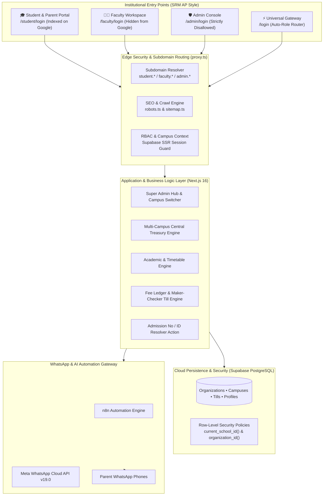

# Finkfold Educational Operating System (EdOS) — Master Project Documentation

**System Version**: 2.5 (Enterprise Multi-Campus Edition)  
**Target Institution**: Priyanka English Medium School & Trust Multi-Branch Campuses  
**Technology Base**: Next.js 16 (Turbopack) • React 19 • Supabase PostgreSQL • Meta WhatsApp Cloud API • n8n Automation Engine  
**Last Updated**: September 2026  

---

## Executive Summary & System Overview

**Finkfold** is an Autonomous, AI-Augmented Educational Operating System (EdOS) designed to replace legacy educational ERPs (e.g., Fedena, PS Labs) with an event-driven, multi-tenant cloud platform.

### Core Problems Solved
1. **Multi-Campus Multi-Tenant Scale**: Eliminates fragmented spreadsheets across 3+ physical campuses (Fathekhan Pet Main, Gandhi Nagar, Haranathpuram) through unified organization-level governance and granular Row-Level Security (RLS).
2. **Cash Leakage & Trust Deficit**: Replaces unmonitored cash handling with **Maker-Checker End-Of-Day (EOD) Cash Tills**, dynamic UPI QR routing directly into branch bank accounts, and daily automated financial audits.
3. **Low Digital Literacy**: Solves the 80%+ failure rate of traditional mobile apps by delivering attendance alerts, absence reason buttons, and fee receipts directly via **Meta WhatsApp Cloud Platform** in vernacular language.
4. **Institutional Portal Segmentation**: Replaces generic role-picking login screens with dedicated institutional portals modeled after premier universities (like SRM AP `student.srmap.edu.in`), where the **Student Portal** is indexed on Google while **Faculty** and **Admin Consoles** remain strictly private and hidden from search engines.

---

## System Architecture & Technology Stack



### Detailed Tech Stack Breakdown
* **Frontend Framework**: Next.js 16.3.5 (App Router, Turbopack, React 19 Server Components, Server Actions).
* **Styling Architecture**: Tailored Vanilla CSS design system with HSL design tokens, modern typography (`Outfit` for institutional branding, `Inter` for tabular data), glassmorphism, responsive data grids.
* **Database & Auth**: Supabase PostgreSQL with custom enums (`app_role`: `super_admin`, `school_admin`, `teacher`, `parent`), Foreign Key cascades, and granular Row Level Security (RLS).
* **Multi-Campus Context Routing**: Custom Next.js 16 `proxy.ts` propagating active campus cookies (`finkfold_active_school`), subdomains (`student.priyanka.school`), and downstream headers (`x-school-id`).
* **WhatsApp Cloud Platform**: Meta Graph API v19.0 (WABA Account ID `1718429122911368`, Phone Number ID `1144602028740736`).
* **Automation Workflow**: n8n Cloud Webhooks (`https://finkfold.app.n8n.cloud/webhook/attendance`) with HMAC SHA-256 validation and direct Meta Graph failover.

---

## Dedicated Institutional Portals & SEO Isolation

Unlike legacy portals that force all users onto a single generic login page with confusing role checkboxes, Finkfold EdOS provides **dedicated, specialized institutional gateways**:

| Portal | URL Route | Subdomain Route | Google Search (SEO) | Supported Login ID | Landing Workspace |
| :--- | :--- | :--- | :--- | :--- | :--- |
| **🎓 Student & Parent Portal** | `/student/login` | `student.priyanka.school` | **Indexed** (`index, follow`) | **Admission Number** (e.g. `PRIY-2026-001`, `001`) or Email | `/portal/student` |
| **👨‍🏫 Faculty & Staff Workspace** | `/faculty/login` | `faculty.priyanka.school` | **Hidden** (`noindex, nofollow`) | **Teacher Email / Employee ID** | `/portal/faculty` |
| **🛡️ Executive Admin Console** | `/admin/login` | `admin.priyanka.school` | **Strictly Disallowed** (`robots.txt` Disallow) | **Administrator Work Email** | `/portal/admin` (Super Admin & Branch Admin) |
| **⚡ Smart Universal Gateway** | `/login` | N/A | **Indexable Gateway** | Any email or student ID (auto-detects role without tabs) | Designated dashboard |

### 1. Student Portal Discoverability & Admission ID Login
- **Google Search Visibility**: The Student Portal at `/student/login` includes OpenGraph and rich meta tags (`Student & Parent Portal - Priyanka EM School`). When parents or students search Google for *"Priyanka School Student Portal"*, this portal ranks at the top.
- **Admission Number Resolver (`src/actions/studentAuth.ts`)**: Students often forget their email address. They can log in using their **Admission Number** (e.g., `PRIY-2026-001` or `001`) or their registered phone number. The server automatically maps it to their secure auth identity.

### 2. Search Engine Privacy for Faculty & Admin
- **`src/app/robots.ts`**: Dynamically generates instructions for Googlebot and other web crawlers:
  - **Disallow**: `/admin/`, `/admin/*`, `/portal/admin/*`, `/faculty/`, `/faculty/*`, `/portal/faculty/*`, `/api/*`.
  - **Allow**: `/`, `/student/login`, `/portal/student/*`, `/about`, `/academics`, `/admissions`, `/contact`.
- **`src/app/sitemap.ts`**: Indexes public admissions and the Student Portal while completely omitting faculty and administrative endpoints.
- **Admin Clearance Gate**: If an unauthorized user (like a student or teacher) attempts to sign in on `/admin/login`, the security gate rejects the session with an explicit *"Access Denied: Administrative Credentials Required"* message.

---

## Multi-Campus EdOS Architecture & Treasury Engine

### 1. Multi-Tenant Data Model
* **Organizations (`organizations`)**: High-level trust entity (e.g., *Priyanka Educational Trust*).
* **Campuses (`schools`)**: Physical branches under the organization (e.g., *Main Campus*, *Gandhi Nagar Branch*, *Haranathpuram Branch*).
* **Bank Accounts (`bank_accounts`)**: Dedicated branch accounts with IFSC, virtual payment addresses (VPA), and branch routing flags.
* **Campus Profiles (`profiles`)**: Users mapped to schools with dual roles (`role`, `primary_role`, and array `roles` for multi-campus administrators).

### 2. Super Admin Campus Switcher (`src/components/BranchSwitcher.tsx`)
* Located permanently in the top navigation bar for Super Admins.
* Allows instantaneous switching between campuses with zero page reloads.
* Persists the active campus context in secure HTTP-only cookies (`finkfold_active_school`) and updates downstream database queries immediately.

### 3. Multi-Campus Central Treasury Dashboard (`/portal/admin/treasury`)
* **Consolidated Revenue Metrics**: Real-time aggregated fee collections across all branches, total pending dues, and active bank balances.
* **Branch-by-Branch Breakdown**: Comparative cards showing collected revenue, fee recovery rate, and pending balances for each individual branch.
* **Inter-Branch Fund Transfers**: Formalized transfer mechanism with debit/credit ledger tracking, reference numbers, and reason logging.
* **Branch Bank Accounts Directory**: Overview of all active institutional bank accounts and UPI VPAs.

### 4. Maker-Checker EOD Cash Tills (`cash_till_sessions`)
* Eliminates multi-branch cash collection discrepancies.
* **Maker (Front-desk cashier)**: Opens till in the morning, collects fees, and enters closing cash count at 5:00 PM.
* **Checker (Principal / Branch Admin)**: Physically audits currency denominations, records discrepancy notes (over/short), and formally closes the till session.

---

## Role-Based User Manuals

### 1. Super Admin Manual (Trust Chairman / Central Director)
* **Login URL**: `/admin/login`
* **Credentials**: `superadmin@priyanka.school` / `Admin@123`

#### Key Workflows:
1. **Multi-Campus Switching**:
   - Look at the top navigation bar. Click the **Campus Selector** dropdown.
   - Choose any branch (*Fathekhan Pet Main*, *Gandhi Nagar*, or *Haranathpuram*).
   - All statistics, student rosters, and fee ledgers instantly switch to the selected campus.
2. **Central Treasury & Financial Governance**:
   - In the sidebar, navigate to **Treasury**.
   - Review total trust revenue, collection efficiency %, and individual branch balances.
   - Click **Transfer Funds** to allocate operational capital between branches with automated ledger entries.
3. **Global Academics & Fee Structures**:
   - Access **Academics** to oversee curriculum structures and terms across branches.
   - Access **Fee Structures** to view universal and branch-specific fee categories.

---

### 2. School / Branch Admin Manual (Principal / Headmaster)
* **Login URL**: `/admin/login`
* **Credentials**: `admin@priyanka.school` / `Teacher@123`

#### Key Workflows:
1. **Daily Operational Dashboard**:
   - Monitor real-time morning attendance across all classes (e.g. Class 1 to Class 10).
   - Track WhatsApp absence message delivery status.
2. **Academics & Timetable Management (`/portal/admin/academics`)**:
   - Configure grade levels, sections, academic terms, and master timetables.
3. **Fee Collection & Cash Tills (`/portal/admin/fees`)**:
   - Record student fee payments (Cash, UPI, Cheque, Bank Transfer).
   - Apply approved scholarships and fee concessions.
   - Perform End-Of-Day (EOD) till reconciliation and signature sign-off.
4. **Bulk Student Onboarding (`/portal/admin/students/import`)**:
   - Upload student rosters via CSV/Excel in seconds instead of manual one-by-one data entry.
   - Automatic generation of student admission numbers and parent accounts.
5. **Staff Allocation (`/portal/admin/staff`)**:
   - Onboard teachers, assign subjects and class teacher responsibilities, or relieve staff.

---

### 3. Faculty / Teacher Manual
* **Login URL**: `/faculty/login`
* **Credentials**: `teacher@priyanka.school` / `Teacher@123`

#### Key Workflows:
1. **Morning Roll Call Attendance**:
   - Open the **Faculty Workspace**. Select assigned class (e.g., *Class 10 - Section A*).
   - Tap **Present** or **Absent** for each student.
   - Click **Submit Attendance**.
   - **Automation**: The system instantly dispatches WhatsApp absence alerts with interactive reason buttons to parents within 3 seconds.
2. **Inbound Parent Messages**:
   - View parents' replies directly in the message center (e.g., *"Child has fever, will attend tomorrow"*).
   - Acknowledge or forward medical leave notes with one click.
3. **Homework & Diary Updates**:
   - Post daily subject homework with due dates and instructions.
   - Parents immediately see homework in their portal and WhatsApp notifications.
4. **Classroom Analytics**:
   - View attendance percentage trends, chronic absenteeism warnings, and high-performer logs.

---

### 4. Student & Parent Manual
* **Login URL**: `/student/login` (or `student.priyanka.school`)
* **Credentials**: `student@priyanka.school` (or `PRIY-2026-001`) / `Student@123`

#### Key Workflows:
1. **Easy Sign-in without Email**:
   - Enter your **Admission Number** (e.g., `PRIY-2026-001` or `001`) found on your school ID card or fee receipt.
   - Enter your password.
2. **Fee Portal & Dynamic UPI Payment (`/portal/student/fees`)**:
   - View itemized fee dues for the term (Tuition, Transport, Examination, Books).
   - Scan the **Dynamic UPI QR Code**: Opens Google Pay, PhonePe, or Paytm with the exact amount and account pre-filled.
   - Download official school digital fee receipts instantly after payment verification.
3. **Attendance & Academic Progress**:
   - View full month-by-month attendance calendar (Present/Absent/Holiday).
   - Track overall attendance percentage to ensure state board compliance (75%+).
4. **School Circulars & Timetable**:
   - View weekly timetable schedule and download exam circulars.

---

## Meta WhatsApp Automation & n8n Workflow

```
Teacher Submits Roll Call (8:45 AM)
         │
         ▼
Next.js Server Action: submitAttendance()
         │
         ├──► Database: Inserts attendance_records
         │
         └──► HTTP POST to n8n Webhook: https://finkfold.app.n8n.cloud/webhook/attendance
                   │
                   ├──► n8n validates HMAC secret header
                   ├──► Fetches Meta Cloud Template: school_absence_notification_v2
                   └──► Calls Meta Graph API v19.0
                             │
                             ▼
               Parent's WhatsApp Phone (8:45:03 AM)
               "Dear Sri Goud garu, Arjun Reddy was marked ABSENT today."
               [🔘 Child is Sick] [🔘 Attending Function] [🔘 Bus Missed]
                             │
                             ▼ (Parent taps button)
               Meta Webhook: /api/whatsapp-reply
                             │
                             ▼
               Database: Updates absence_reasons & logs to Teacher Portal
```

### Key Technical Specs:
* **Webhook Endpoint**: `POST /api/webhook/whatsapp-status` & `/api/whatsapp-reply`
* **HMAC Signature**: Validated using `N8N_ATTENDANCE_WEBHOOK_SECRET`
* **Fallback Guarantee**: If the n8n webhook encounters network timeout, the Next.js server action automatically falls back to direct Meta Graph API dispatch (`src/lib/whatsapp.ts`).

---

## Verified System Credentials Directory

| User Persona | Dedicated Portal Route | Login Email / ID | Default Password | Clearance Level |
| :--- | :--- | :--- | :--- | :--- |
| **Trust Super Admin** | `/admin/login` | `superadmin@priyanka.school` | `Admin@123` | Multi-Branch Treasury & Organization Control |
| **School / Branch Admin** | `/admin/login` | `admin@priyanka.school` | `Teacher@123` | Branch Administration & EOD Cash Till Checker |
| **Faculty / Teacher** | `/faculty/login` | `teacher@priyanka.school` | `Teacher@123` | Attendance Roll-Call & Classroom Assignments |
| **Student / Parent** | `/student/login` | `student@priyanka.school` *(or `PRIY-2026-001`)* | `Student@123` | Fee Payments, Attendance Records, Circulars |

---

## Maintenance, Security & Deployment Guide

### 1. Deployment & CI/CD
* **Hosting**: Vercel Serverless Edge Platform.
* **Build Command**: `npm run build` (Next.js 16 Turbopack).
* **Git Repository**: `https://github.com/yasaswinisaisuryaprabhanagam-wq/Finkfold_Priyanka_School.git`
* **Pushing Updates**:
  ```powershell
  git remote set-url origin https://<YOUR_GITHUB_TOKEN>@github.com/yasaswinisaisuryaprabhanagam-wq/Finkfold_Priyanka_School.git
  git push origin master
  ```

### 2. Environment Variables Checklist
| Variable | Description |
| :--- | :--- |
| `NEXT_PUBLIC_SUPABASE_URL` | Supabase Cloud Database URL |
| `NEXT_PUBLIC_SUPABASE_ANON_KEY` | Public Anon Key for Client SDK |
| `SUPABASE_SERVICE_ROLE_KEY` | Privileged Key for Server Actions & Seed Scripts |
| `N8N_ATTENDANCE_WEBHOOK_URL` | n8n Cloud Attendance Webhook |
| `N8N_ATTENDANCE_WEBHOOK_SECRET` | HMAC Secret for Attendance Payloads |
| `META_WHATSAPP_TOKEN` | Meta Graph System User Permanent Access Token |
| `META_PHONE_NUMBER_ID` | Meta Registered WABA Phone ID (`1144602028740736`) |
| `NEXT_PUBLIC_SITE_URL` | Canonical Institutional URL for SEO & Sitemaps |

---

*Finkfold Educational Operating System (EdOS) — Autonomous, Multi-Campus Educational Management Platform.*
