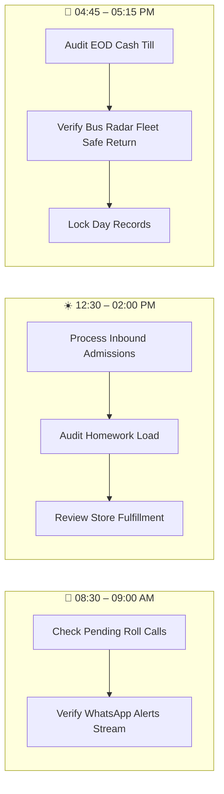

# Finkfold Educational Operating System (EdOS) — School & Branch Admin Portal
## The Ultimate Operational User Manual & Executive Blueprint

---

## 🏛️ Executive Welcome & System Philosophy

Welcome to the **Finkfold EdOS School Administrator Portal**—the enterprise command center engineered specifically for **Principals, Vice Principals, Headmasters, Administrative Officers, and Campus Bursars**.

Modern institutional leadership requires moving beyond paper registers, disconnected spreadsheets, and fragmented WhatsApp chats. Inspired by premier global enterprise platforms such as **PowerSchool Analytics, Tableau, Darwinbox, Workday, Camu, ManageBac, and Fedena**, Finkfold EdOS equips school administrators with a synchronized, real-time operating system.

> [!IMPORTANT]
> **Scope of this Manual**:
> This manual is dedicated exclusively to the **School / Branch Admin** role (managing day-to-day campus operations, staff, classes, admissions, fee cash till, students, logistics, and facilities of your campus). Multi-campus organization-wide treasury capital transfers and trust-level organization provisioning are governed by the Trust Super Admin.

---

## 🔑 Login & Access Security

1. Open your web browser (**Google Chrome, Safari, Microsoft Edge, or Mozilla Firefox**).
2. Navigate to your campus admin address:
   - **Production**: `https://your-school-url.vercel.app/admin/login`
   - **Local Development**: `http://localhost:3000/admin/login`
3. Enter your Administrator credentials:
   - **Username / Email**: `admin@priyanka.school`
   - **Password**: `Teacher@123`
4. Click **"Sign In to Admin Workspace"**.
5. You will land directly on the **Executive Overview Dashboard** (`/portal/admin`).

> [!NOTE]
> **Zero Search Engine Exposure**:
> The Admin Portal is strictly blocked from search engines via `robots.txt` (`Disallow: /admin/*`, `Disallow: /portal/admin/*`). Role-Based Access Control (RBAC) automatically redirects students, parents, or teachers attempting to access admin endpoints to their designated portals.

---

# 🧭 Table of Contents

- [SECTION 1: Executive Intelligence & AI Forecasting](#section-1-executive-intelligence--ai-forecasting)
  - [1. AI Enrollment Forecasting & Lead CRM](#1-ai-enrollment-forecasting--lead-crm)
  - [2. Multi-Campus Central Treasury & Tally-Sync](#2-multi-campus-central-treasury--tally-sync)
- [SECTION 2: "Smart Campus" Logistics & Fleet Command](#section-2-smart-campus-logistics--fleet-command)
  - [3. E-Commerce Fulfillment & Store Indent Command](#3-e-commerce-fulfillment--store-indent-command)
  - [4. Live Fleet Radar & RFID Gate Control](#4-live-fleet-radar--rfid-gate-control)
- [SECTION 3: HR, Recruitment & Staff Appraisals](#section-3-hr-recruitment--staff-appraisals)
  - [5. Applicant Tracking System (ATS) & Recruitment](#5-applicant-tracking-system-ats--recruitment)
  - [6. 360° Faculty Appraisal Matrix](#6-360-faculty-appraisal-matrix)
- [SECTION 4: Academic Governance & NEP 2020 Compliance](#section-4-academic-governance--nep-2020-compliance)
  - [7. NEP 2020 Outcome-Based Education (OBE) Auditor](#7-nep-2020-outcome-based-education-obe-auditor)
  - [8. The "SafeSpace" Grievance Triage Board](#8-the-safespace-grievance-triage-board)
- [SECTION 5: Campus Maintenance & Helpdesk Operations](#section-5-campus-maintenance--helpdesk-operations)
  - [9. Estate & Facility Management Command](#9-estate--facility-management-command)
  - [10. The Omnichannel Broadcast Studio](#10-the-omnichannel-broadcast-studio)
- [Administrator Daily Operational Checklist](#administrator-daily-operational-checklist)
- [Troubleshooting & Frequently Asked Questions (FAQ)](#troubleshooting--frequently-asked-questions-faq)

---

# SECTION 1: EXECUTIVE INTELLIGENCE & AI FORECASTING
*(Inspired by PowerSchool Analytics and Tableau)*

---

### 1. AI Enrollment Forecasting & Lead CRM
**Route**: `/portal/admin/admissions/crm` (or under `/portal/admin/admissions`)

#### 💥 The Real-World Problem
Schools spend lakhs on marketing (billboards, newspaper inserts, Facebook/Instagram ads) but have no idea which channel actually brings in admissions. Administrators guess next year's classroom capacity, leading to either overcrowded classrooms or empty seats and lost revenue.

#### 💡 The Finkfold Solution
Finkfold replaces guesswork with an intelligent prospective student pipeline:
1. **Lead Conversion Funnel**: An interactive CRM board tracking prospective parents through 4 distinct stages:
   $$\text{New Lead} \longrightarrow \text{Campus Tour Scheduled} \longrightarrow \text{Document Verification} \longrightarrow \text{Enrolled}$$
2. **Marketing ROI Tracker**: Automatically correlates admission inquiries with the "Referred By" tracking field (e.g. *Main Highway Hoarding, Facebook Campaign #3, Word-of-Mouth, Alumni Reference*) to display the exact rupee revenue generated per marketing rupee spent.
3. **Predictive Capacity Engine**: Machine learning algorithms analyze 3 years of historical transfer/dropout trends and predict the exact number of vacant seats Class 1 will have next academic session. When class enrollment reaches **95% of safe capacity**, the system automatically triggers a digital waitlist on the school website.

#### 🖥️ Step-by-Step Screen Walkthrough:
1. **Viewing the Funnel**:
   - Open `/portal/admin/admissions/crm`.
   - The top metrics card displays **Total Leads (148)**, **Tours Completed (92)**, **Verified (64)**, and **Final Enrolled (58)**, with an overall **39.1% Conversion Efficiency**.
2. **Interacting with Lead Cards**:
   - Drag a parent card (e.g., *Parent: Srikanth V. for Student: Ananya, Class 1*) across columns as they progress from "Campus Tour" to "Document Verification".
   - Click the card to view parent notes, student DOB eligibility, and callback logs.
3. **Checking Marketing ROI**:
   - Switch to the **Campaign Performance** tab.
   - Inspect the table:
     - *Highway Billboard 01*: ₹45,000 spend $\rightarrow$ 18 Inquiries $\rightarrow$ 12 Enrolled $\rightarrow$ ₹5,40,000 Revenue (**12x ROI**).
     - *Facebook Digital Ads*: ₹15,000 spend $\rightarrow$ 42 Inquiries $\rightarrow$ 6 Enrolled $\rightarrow$ ₹2,70,000 Revenue (**18x ROI**).
     - *Newspaper Pamphlets*: ₹20,000 spend $\rightarrow$ 4 Inquiries $\rightarrow$ 1 Enrolled (**Poor ROI $\rightarrow$ System suggests defunding**).
4. **Predictive Capacity Warning**:
   - Look at the **Capacity Gauge**. If Grade 1 reaches 38/40 seats (95%), the badge turns **Amber** and activates the one-click toggle: *"Enable Digital Waitlist with Token Queue"*.

---

### 2. Multi-Campus Central Treasury & Tally-Sync
**Route**: `/portal/admin/treasury` & `/portal/admin/fees`

#### 💥 The Real-World Problem
Accountants hate double data entry. Front-desk staff collect student tuition, bus, and uniform fees in the school software, and then the campus accountant spends days manually re-typing every receipt into **Tally ERP9 / TallyPrime** for the chartered accountant, causing human errors, delayed audits, and reconciliation headaches.

#### 💡 The Finkfold Solution
Finkfold automates accounting handoffs and eliminates manual tally work:
1. **1-Click Tally XML Export**: Maps every fee transaction to standard double-entry accounting ledger heads (*Ledger: Current Asset / Bank / Cash*, *Credit: Tuition Income / Transport Income / Caution Deposit*). One click generates a fully formatted, valid XML batch file ready to import into Tally ERP9/Prime with zero manual typing.
2. **Automated Bank Reconciliation**: Administrators upload the Trust's monthly bank statement (CSV). The system's AI cross-matches UTR numbers from dynamic UPI transactions against the bank statement, instantly flagging missing credits, chargebacks, or bounced cheques.

#### 🖥️ Step-by-Step Screen Walkthrough:
1. **Exporting to Tally**:
   - Navigate to `/portal/admin/treasury` and click the **Tally Export & Audit** tab.
   - Select the date range (e.g., *1st September 2026 to 19th September 2026*).
   - Click **"Generate Tally XML"**.
   - The system validates ledger codes (`FEE_TUITION_10`, `BUS_REV_R4`, `BANK_SBI_PRIY_MAIN`) and downloads `Finkfold_Tally_Import_Sep2026.xml`.
   - In Tally: Go to *Import Data $\rightarrow$ Vouchers $\rightarrow$ Select File*. All 500+ receipts are imported into Tally in 4 seconds!
2. **Reconciling Bank Statements**:
   - In the **Bank Reconciliation** panel, click **"Upload Bank Statement (CSV)"**.
   - The engine parses 300+ line items:
     - 🟢 **Matched (98.4%)**: Exact UPI UTR match with student fee transaction.
     - 🟡 **Pending Settlement (1.2%)**: Payment initiated at 11:55 PM, cleared in bank next morning.
     - 🔴 **Discrepancy (0.4%)**: Unclaimed direct NEFT transfer without student admission reference $\rightarrow$ Admin can assign it to a student with 1 click.

---

# SECTION 2: "SMART CAMPUS" LOGISTICS & FLEET COMMAND
*(Syncs directly with the Student Portal Transport & Store modules)*

---

### 3. E-Commerce Fulfillment & Store Indent Command
**Route**: `/portal/admin/store-fulfillment` (or `/portal/admin/store`)

#### 💥 The Real-World Problem
Parents and students order uniform sizes, lab coats, and textbook kits online through the Student Portal. Meanwhile, teachers submit urgent store indents for whiteboard markers and lab chemicals via the Faculty Portal. The school storekeeper is overwhelmed with paper chits, WhatsApp messages, and confused students during lunch break.

#### 💡 The Finkfold Solution
A centralized digital warehouse command center:
1. **The "Pick & Pack" Dashboard**: The storekeeper sees an aggregated, live queue of paid student orders and teacher desk requisitions. Clicking **"Generate Pick List"** produces an optimized warehouse walking route: *"Go to Aisle 2, Bin B: Grab 14 Medium Polo Shirts; Go to Aisle 4: Grab 8 Class-10 CBSE Kits."*
2. **1-Scan Dispatch**: The storekeeper packs the kit into a bag, scans the order barcode with any handheld USB or camera scanner, and the system instantly dispatches a WhatsApp notification to the parent/student: *"Your order #ORD-PRIY-1042 is packed! Collect from Counter 2 during Lunch Break."*
3. **Automated Vendor Re-ordering**: When inventory of critical items (e.g. Size 32 Uniform Shirts, A4 Paper Bundles) drops below safety thresholds (e.g., 20 units), the system auto-drafts a formal Purchase Order (PO) PDF and emails it to the pre-registered supplier with 1-click administrative approval.

#### 🖥️ Step-by-Step Screen Walkthrough:
1. **Processing Orders**:
   - Open `/portal/admin/store-fulfillment`.
   - The queue shows tabs: `Unfulfilled (18)`, `Packed & Ready (12)`, `Dispatched / Collected (142)`.
   - Click **"Generate Master Pick List"** to print or view the consolidated inventory picking sheet.
2. **Barcode Scanning**:
   - Place cursor in the **"Barcode Scanner"** field.
   - Scan student order voucher `QR-STORE-ORD-1042`.
   - Order status immediately flips from `packing` to `ready_for_pickup`.
   - Automated WhatsApp alert fires to student Kiran Kumar.
3. **Vendor Re-order Alerts**:
   - If Whiteboard Markers fall to 8 units (Threshold: 15), a prominent badge appears: *"Low Stock Alert — 8 Units Remaining"*.
   - Click **"Review Vendor PO"**: Inspects supplier unit price, pre-fills vendor address, and generates `PO-2026-PRIY-SUPPLY-04.pdf`.

---

### 4. Live Fleet Radar & RFID Gate Control
**Route**: `/portal/admin/fleet` (or under `/portal/admin/transport`)

#### 💥 The Real-World Problem
An anxious parent calls the school reception in a panic shouting: *"Where is Bus Number 4? It was supposed to reach Magunta Layout at 4:10 PM!"* The receptionist has to call the bus driver—who is actively navigating heavy traffic and should never be answering a mobile phone while driving. Meanwhile, at the main gate, security has no live record of who walked in or left campus.

#### 💡 The Finkfold Solution
Complete telematics and security perimeter command:
1. **Live GPS Control Tower**: An interactive high-definition map displaying all 15 school buses moving in real-time. Each vehicle is color-coded by telemetry status:
   - 🟢 **Green**: On schedule and speed within safe limits (<40 km/h).
   - 🟡 **Yellow**: Mild delay (>8 minutes behind schedule due to roadwork).
   - 🔴 **Red Alert**: Overspeeding (>50 km/h) or unapproved route detour.
2. **Turnstile / Gate Sync**: A real-time synchronized event stream of every student, teacher, and visitor swiping their RFID cards or scanning dynamic QR passes at the main security turnstiles. Instantly alerts security to unauthorized gate exits or perimeter breaches.

#### 🖥️ Step-by-Step Screen Walkthrough:
1. **Monitoring Bus Fleet**:
   - Open `/portal/admin/fleet`.
   - Look at the **Live Fleet Radar**:
     - *Bus 04 (AP 26 TE 4821)*: Speed 32 km/h, Location: Trunk Road Circle, 24 students onboard, Next Stop: Santhi Nagar (ETA: 4 mins).
     - *Bus 07 (AP 26 TE 9104)*: Speed 28 km/h, Location: Magunta Layout.
   - Click any bus pin to view the student manifest and real-time passenger count.
2. **RFID Gate Feed**:
   - Look at the **Main Gate Security Stream**:
     - `08:04:12 AM` — *Kiran Kumar (Roll 1, Class 10-A)* swiped RFID $\rightarrow$ Safe entry recorded $\rightarrow$ Parent WhatsApp dispatched.
     - `08:06:45 AM` — *Mrs. Priyanka Devi (Faculty - Math)* swiped $\rightarrow$ Biometric morning punch recorded.
     - `01:15:20 PM` — ⚠️ *Unscheduled Gate Exit Attempt*: Student #PRIY-2026-088 scanned at Gate 2 without approved Out-Pass $\rightarrow$ Turnstile locks, red alarm flashes on security console.

---

# SECTION 3: HR, RECRUITMENT & STAFF APPRAISALS
*(Inspired by Darwinbox and Workday)*

---

### 5. Applicant Tracking System (ATS) & Recruitment
**Route**: `/portal/admin/staff/recruitment` (or under `/portal/admin/staff`)

#### 💥 The Real-World Problem
Hiring a senior Physics or Mathematics teacher involves sifting through 150+ emailed PDF resumes, losing track of candidate demo classes in messy email threads, and then spending hours manually creating login credentials, employee records, and biometric registrations when a candidate is hired.

#### 💡 The Finkfold Solution
An end-to-end recruitment pipeline built directly into your school ERP:
1. **Careers Portal Sync**: Candidates apply through the school's public website (`/careers`). Finkfold's resume parser automatically extracts years of CBSE experience, degree qualifications (e.g. *M.Sc. Physics, B.Ed.*), and contact details into a structured candidate profile.
2. **Interview Kanban Board**: A visual workflow board enabling administrators to drag candidate cards across 5 recruitment stages:
   $$\text{Applied (34)} \longrightarrow \text{Shortlisted (12)} \longrightarrow \text{Demo Class Scheduled (5)} \longrightarrow \text{Principal Interview (3)} \longrightarrow \text{Hired (1)}$$
3. **1-Click Faculty Onboarding**: Dragging a card to **"Hired"** automatically provisions:
   - Unique Employee ID (e.g. `EMP-PRIY-2026-042`).
   - Faculty Portal credentials (`newteacher@priyanka.school` with secure temporary password).
   - Syncs their profile with the campus biometric fingerprint/facial scanner.

#### 🖥️ Step-by-Step Screen Walkthrough:
1. **Managing Candidates**:
   - Open `/portal/admin/staff/recruitment`.
   - Review the candidate card: *Dr. S. Ramanujan — 8 Years Exp, CBSE Senior Secondary Physics*.
   - Click **"Schedule Demo Class"**: Input date, class section (Class 10-B), and topic (*Electromagnetic Induction*). The system emails the candidate and adds the demo to the observer calendar.
2. **Completing 1-Click Onboarding**:
   - After the demo, drag the card into the **"Hired"** column.
   - A modal appears: *"Confirm Onboarding for Dr. S. Ramanujan"*.
   - Select primary homeroom or subjects. Click **"Confirm & Provision Account"**.
   - In 2 seconds, credentials are created, welcome email is dispatched, and staff directory is updated!

---

### 6. 360° Faculty Appraisal Matrix
**Route**: `/portal/admin/staff/appraisals` (or under `/portal/admin/staff`)

#### 💥 The Real-World Problem
Evaluating teacher performance is often subjective, biased, and based on favoritism rather than hard empirical evidence. Excellent teachers who work quietly are overlooked, while charismatic staff who show up late get promoted.

#### 💡 The Finkfold Solution
Finkfold compiles an objective, mathematically grounded **Performance Dossier** for every educator, aggregating data across 4 unbiased institutional vectors:
1. **Punctuality Score (25%)**: Calculated mathematically from biometric gate logs (arrival before 08:30 AM, zero unexcused morning tardiness).
2. **Academic Impact (35%)**: Class average marks in their specific subject vs. previous academic years (e.g. *Class 10-A Math average increased from 71.4% to 84.2% under Mrs. Priyanka Devi*).
3. **Parent Feedback (20%)**: Sentiment analysis extracted from verified Parent-Teacher Meeting (PTM) consultation feedback and parent ratings.
4. **Relief Cooperation (20%)**: Tracks how many times the teacher voluntarily accepted period substitutions and relief duties when colleagues were absent.

$$\text{Final Appraisal Score} = (0.25 \times \text{Punctuality}) + (0.35 \times \text{Academic}) + (0.20 \times \text{Parent}) + (0.20 \times \text{Relief})$$

#### 🖥️ Step-by-Step Screen Walkthrough:
1. Open `/portal/admin/staff/appraisals`.
2. Inspect the **Faculty Leaderboard**:
   - *Mrs. Priyanka Devi (Mathematics)*: Overall **94.6 / 100 (Tier: Outstanding)**.
     - Punctuality: 98% (Only 1 late arrival in 180 days).
     - Academic Impact: +12.8% class mark gain.
     - Parent Sentiment: 4.8 / 5.0 (96% positive remarks).
     - Relief Acceptance: 14 / 14 periods covered.
3. Click **"Export Annual Appraisal Summary"**: Generates a standardized, objective PDF report card for the Chairman and Principal to determine annual salary increments and promotions.

---

# SECTION 4: ACADEMIC GOVERNANCE & NEP 2020 COMPLIANCE
*(Inspired by Camu and ManageBac)*

---

### 7. NEP 2020 Outcome-Based Education (OBE) Auditor
**Route**: `/portal/admin/academics/obe` (or under `/portal/admin/academics`)

#### 💥 The Real-World Problem
India's National Education Policy (NEP 2020) and modern accreditation boards mandate that schools prove they are fostering critical thinking, evaluation, and analytical reasoning—not just rote memorization. School principals have no way to audit whether teachers are actually applying Bloom's Taxonomy in daily classroom lessons.

#### 💡 The Finkfold Solution
Because faculty members tag their lesson plans, unit resources, and exam questions with Bloom's Taxonomy cognitive levels (*Remembering, Understanding, Applying, Analyzing, Evaluating, Creating*) in the Faculty Portal, the Admin Portal synthesizes this data into a **Global School OBE Heatmap**:
- Instantly visualizes cognitive distribution across subjects and grades.
- Detects imbalances (e.g., *"Class 8 Science is 82% 'Remembering' and 0% 'Evaluating'"*).
- Empowers the Academic Coordinator to mandate hands-on labs and project-based assessments where cognitive diversity is lacking.

#### 🖥️ Step-by-Step Screen Walkthrough:
1. Open `/portal/admin/academics/obe`.
2. Review the **Cognitive Domain Distribution Chart**:
   - 🧠 *Remembering & Rote*: 28% (Healthy benchmark is <30%)
   - 🔍 *Understanding & Explaining*: 24%
   - ⚙️ *Applying & Problem Solving*: 26%
   - 📊 *Analyzing & Deconstructing*: 12%
   - ⚖️ *Evaluating & Critiquing*: 6%
   - 🚀 *Creating & Prototyping*: 4%
3. **Inspect Flagged Class Warning**:
   - System highlights *Class 8 - Section B Science*: *"Curriculum audit indicates 85% rote memorization questions in recent cycle test."*
   - Click **"Send NEP Adjustment Directive"**: Dispatches an automated coaching note to the department head requesting inclusion of case study and lab hypothesis tasks.

---

### 8. The "SafeSpace" Grievance Triage Board
**Route**: `/portal/admin/safespace` (or under `/portal/admin`)

#### 💥 The Real-World Problem
Students submit sensitive reports through the student portal's anonymous drop-box (e.g., severe bullying, mental health distress, emotional abuse). If a critical report sits unread in a generic email inbox over a weekend, catastrophic harm can occur.

#### 💡 The Finkfold Solution
A dedicated crisis triage engine restricted exclusively to the **Principal and Head Counselor**:
1. **Emergency Triage Dashboard**: Inbound reports are parsed by natural language severity classifiers and sorted into risk tiers: `Critical (Red)`, `High (Amber)`, `Standard (Blue)`.
2. **2-Hour SLA Countdown Clock**: When a `Critical` grievance arrives, a **2-hour countdown timer** starts ticking on the administrator console:
   - If the counselor logs an intervention note within 2 hours: The clock turns green.
   - If 2 hours elapse without an intervention: The system automatically escalates an urgent SMS alert directly to the **Trust Chairman's private mobile phone**.
3. **Secure Anonymous Reply**: Counselors and administrators can write back directly to the token ID (e.g. `SAFE-TOKEN-8819`). The student sees the response inside their private SafeSpace portal without ever revealing their name or IP address.

#### 🖥️ Step-by-Step Screen Walkthrough:
1. Open `/portal/admin/safespace`.
2. Inspect the **Active Grievance Feed**:
   - `SAFE-TOKEN-8819` | Severity: **Critical** | Category: *Severe Bullying / Verbal Harassment*
   - **SLA Clock**: `01:42:15 Remaining` (Counting down in bold red).
3. **Logging Counselor Intervention**:
   - Click **"Open Confidential Case"**.
   - Input counselor action: *"Student invited to counselor office during Period 4 for confidential wellness chat. Anti-bullying monitor assigned to senior corridor."*
   - Click **"Log Intervention & Stop SLA Timer"**. The timer halts and case moves to `Active Monitoring`.
4. **Sending Anonymous Reply**:
   - Type in the message box: *"Thank you for your courage in reporting this. You are safe. We have stationed monitors in the corridor and the situation is being addressed immediately."*
   - Click **"Send to Token"**. The student sees this instantly in their portal.

---

# SECTION 5: CAMPUS MAINTENANCE & HELPDESK OPERATIONS
*(Syncs directly with Faculty Maintenance Ticketing)*

---

### 9. Estate & Facility Management Command
**Route**: `/portal/admin/maintenance` (or under `/portal/admin`)

#### 💥 The Real-World Problem
Schools employ plumbers, electricians, carpenters, and IT technicians, but the administrative office has no idea what jobs they are working on, why smartboard repairs take 3 weeks, or which aging air conditioners are draining school funds through endless temporary patches.

#### 💡 The Finkfold Solution
A comprehensive facility and asset maintenance command deck:
1. **The Ticketing Board**: When a teacher reports a broken smartboard in Room 302 or a leaking AC in the junior wing, the ticket lands on the Estate Board. Administrators assign the work order to technician teams with designated SLA targets.
2. **Asset Depreciation & Replacement Tracker**: The system tracks maintenance histories by physical Asset ID (e.g., *Smartboard #SB-4012*). If an asset requires more than 4 repair tickets within a 12-month period, the system flags it for **"End of Life / Budget Replacement"** in next year's capital expenditure budget.
3. **Preventative Maintenance Schedule**: Automated calendar alerts notify the Estate Manager of mandatory recurring inspections (*Quarterly Overhead Water Tank Chemical Cleaning, Fire Extinguisher Refills, Generator Diesel Servicing*).

#### 🖥️ Step-by-Step Screen Walkthrough:
1. Open `/portal/admin/maintenance`.
2. Review the **Live Ticket Kanban**:
   - `Ticket #maint-104`: *Split AC Water Leaking on Front Row Desks (Room 101)*.
   - Severity: **Emergency** | Status: `technician_in_progress`.
   - Assigned: *Technician Ravi (Air Conditioning)*.
3. **Reviewing Asset Replacement Alerts**:
   - Look at the **Asset Health Radar**:
     - *Projector #PRJ-102 (Class 9-A)*: 5 repairs logged in 6 months $\rightarrow$ Status: **Flagged for EOL Replacement (Est. Cost: ₹28,000)**.
4. **Preventative Reminders**:
   - Upcoming Task: *"Overhead Drinking Water Tank Cleaning — Due in 5 Days"*. Click **"Mark Completed"** after inspecting the contractor certificate.

---

### 10. The Omnichannel Broadcast Studio
**Route**: `/portal/admin/broadcast` (or under `/portal/admin/circulars`)

#### 💥 The Real-World Problem
When an emergency occurs (e.g., *"District Collector declares school closed tomorrow morning due to Cyclone Michaung heavy rainfall"*), sending bulk SMS fails because telecom regulatory filters (DLT scrubbing) delay or block messages for hours. Meanwhile, normal circulars posted on websites are missed by 60% of parents.

#### 💡 The Finkfold Solution
The **Waterfall Broadcast Engine**:
Administrators compose one emergency alert, and the system executes an intelligent, cost-saving multi-tiered delivery cascade:
1. **Tier 1 (Instant & Free)**: Dispatches a high-priority push notification to the **Student & Parent Portal App**.
2. **Tier 2 (5-Minute Fallback)**: For any parent who has not opened or acknowledged the app alert within 5 minutes, the engine automatically routes the message through **Meta WhatsApp Cloud API**.
3. **Tier 3 (SMS Failover)**: If WhatsApp delivery fails or the parent does not have an active smartphone data connection, the system triggers a **direct telecom SMS fallback**.
4. **Live Delivery Funnel**: The administrator watches a real-time visual delivery funnel update on screen:
   $$\text{1,000 Dispatched} \longrightarrow \text{950 Delivered on WhatsApp} \longrightarrow \text{50 SMS Delivered} \longrightarrow \text{100\% Parent Reach}$$

#### 🖥️ Step-by-Step Screen Walkthrough:
1. Open `/portal/admin/broadcast`.
2. Click **"Compose Urgent Broadcast"**.
3. Select **Severity**: `🔴 Emergency School Closure` (Overrides quiet hours).
4. Enter Message:
   > *"URGENT: As per District Collector orders, Priyanka EM School will remain closed tomorrow, Monday, due to heavy rainfall. Online classes will resume Tuesday."*
5. Click **"Launch Waterfall Broadcast"**.
6. **Watch the Live Visual Telemetry**:
   - Push notifications fire instantly (0s).
   - At 5:00 minutes: 180 unopened app alerts automatically trigger WhatsApp template `school_closure_alert_v1`.
   - At 6:30 minutes: 12 failed WhatsApp numbers failover to Telecom SMS.
   - Screen displays: **"100% Verified Delivery Accomplished in 6m 42s"**.

---

# 📅 Administrator Daily Operational Checklist

To ensure maximum operational efficiency, follow this standardized 3-phase daily administrative protocol:

### Phase 1: Morning Command (08:30 AM – 09:00 AM)
- [ ] Log in to `/portal/admin`.
- [ ] Check **Pending Roll Calls KPI**. If any homeroom is unmarked at 08:50 AM, click **"Mark →"** or alert the teacher.
- [ ] Inspect the **WhatsApp Delivery Ticker** to confirm absence alerts are reaching parent phones.
- [ ] Review the **SafeSpace Triage Board** for any urgent overnight student grievance tokens.

### Phase 2: Mid-Day Operations (12:30 PM – 02:00 PM)
- [ ] Open **Admissions CRM** (`/portal/admin/admissions/crm`) to move prospective parents through the funnel.
- [ ] Inspect the **Store Fulfillment Pick List** to ensure lunch-break student kits are packed.
- [ ] Review the **Homework Hub** to confirm teachers have posted daily academic assignments.

### Phase 3: Evening Closeout & Till Audit (04:45 PM – 05:15 PM)
- [ ] Open **Live Fleet Radar** (`/portal/admin/fleet`) to confirm all 15 buses have completed afternoon drops.
- [ ] Open **Fee Counter & Cash POS** (`/portal/admin/fees`).
- [ ] Request the Bursar/Cashier's physical cash count, verify against system expected balance, and click **"Approve & Lock Till"**.
- [ ] Export today's transactions to **Tally XML** for accounting archives.

---

# ❓ Troubleshooting & Frequently Asked Questions (FAQ)

#### Q1: What happens if a parent claims they never received an attendance or emergency WhatsApp alert?
**Answer**: Open **WhatsApp Audit Log** (`/portal/admin/whatsapp`). Enter the parent's phone number. The log shows the exact timestamp and delivery code from Meta servers (`delivered`, `read`, or `failed`). If marked `failed`, check that the mobile number includes `+91` and does not have the school's official business number (**7090476291**) blocked.

#### Q2: Can a teacher or cashier unlock an End-Of-Day Cash Till once approved?
**Answer**: **No.** Once the Administrator or Principal approves and locks a till session, it becomes an immutable financial record. Only the Trust Super Admin can authorize a formal till reopening with a documented audit rationale.

#### Q3: How do we import fee records into our chartered accountant's Tally ERP9?
**Answer**: On `/portal/admin/treasury`, click **"Generate Tally XML"**. Open your local Tally ERP9 / TallyPrime company, select *Import Data $\rightarrow$ Vouchers*, and choose the downloaded `.xml` file. All student fee heads, bank debits, and concession credits are imported automatically.

#### Q4: How does the system ensure student anonymity in SafeSpace grievance reports?
**Answer**: Student profiles and IP addresses are completely stripped before being written to the grievance database. The system generates a cryptographic token (e.g. `SAFE-TOKEN-8819`). Administrators and counselors can communicate back and forth with this token through the portal, guaranteeing safety without deanonymizing the student.

---

*Finkfold Educational Operating System (EdOS) — Autonomous, Multi-Campus Educational Management Platform.*
