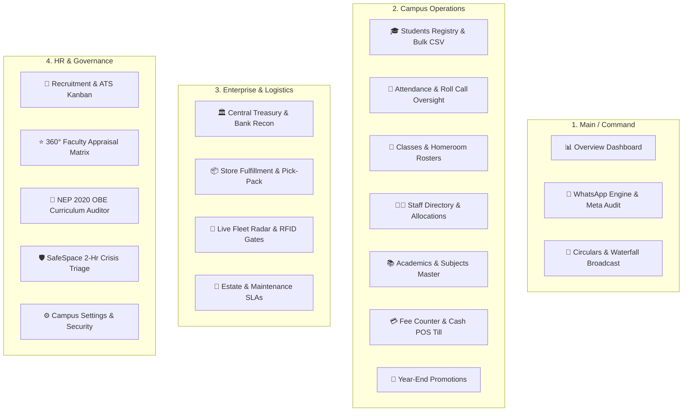
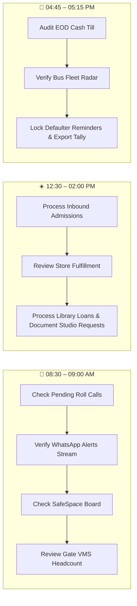

# Finkfold Educational Operating System (EdOS) — School & Branch Admin Portal
## The Ultimate Operational User Manual & Executive Blueprint

---

## 🏛️ Executive Welcome & System Philosophy

Welcome to the **Finkfold EdOS School Administrator Portal**—the enterprise command center engineered specifically for **Principals, Vice Principals, Headmasters, Administrative Officers, and Campus Bursars**.

Modern institutional leadership requires moving beyond paper registers, disconnected spreadsheets, and fragmented WhatsApp chats. Inspired by premier global enterprise platforms such as **PowerSchool Analytics, Tableau, Darwinbox, Workday, Camu, ManageBac, and Fedena**, Finkfold EdOS equips school administrators with a synchronized, real-time operating system.

> [!IMPORTANT]
> **Scope of this Manual**:
> This manual is dedicated exclusively to the **School / Branch Admin** role (managing day-to-day campus operations, staff, classes, admissions, fee cash till, students, logistics, and facilities of your campus). Multi-campus organization-wide treasury capital transfers and trust-level organization provisioning are governed by the Trust Super Admin.

---

## 🔑 Login & Access Security

1. Open your web browser (**Google Chrome, Safari, Microsoft Edge, or Mozilla Firefox**).
2. Navigate to your campus admin address:
   - **Production**: `https://your-school-url.vercel.app/admin/login`
   - **Local Development**: `http://localhost:3000/admin/login`
3. Enter your Administrator credentials:
   - **Username / Email**: `admin@priyanka.school`
   - **Password**: `Teacher@123`
4. Click **"Sign In to Admin Workspace"**.
5. You will land directly on the **Executive Overview Dashboard** (`/portal/admin`).

> [!NOTE]
> **Zero Search Engine Exposure**:
> The Admin Portal is strictly blocked from search engines via `robots.txt` (`Disallow: /admin/*`, `Disallow: /portal/admin/*`). Role-Based Access Control (RBAC) automatically redirects students, parents, or teachers attempting to access admin endpoints to their designated portals.

---

## 🎨 Unified Educational Design System & Navigation Architecture

In alignment with the **Student & Parent Portal** and the **Faculty Command Center**, the Admin Console has been completely re-engineered around a **Calm Mist & Pure White** visual design system. This eliminates neon eye-strain, visual clutter, and saturated dark gradients, providing a focused, high-clarity environment for hours of administrative work.

### 1. Visual Design System & Surface Tokens

| Element | Specification & CSS Tokens | Purpose & Administrative Experience |
| :--- | :--- | :--- |
| **Canvas Background** | `#f8fafc` (`bg-slate-50`) | Soft mist surface that minimizes glare and cognitive fatigue during extended administrative sessions. |
| **Primary Cards** | `#ffffff` (`bg-white border border-slate-200/80 shadow-sm`) | Crisp, pure white elevated containers with gentle rounded corners (`rounded-2xl`) and hairline slate borders. |
| **KPI Stat Surfaces** | **Soft Calm Pastels**:<br/>• **Lilac/Lavender**: `bg-purple-50 text-purple-700`<br/>• **Butter Yellow**: `bg-amber-50 text-amber-700`<br/>• **Sky Blue**: `bg-sky-50 text-sky-700`<br/>• **Mint Green**: `bg-emerald-50 text-emerald-700` | Instantly conveys data categories without jarring neon saturation. Replaces all linear gradients with elegant, flat pastel surfaces. |
| **Typography** | `Outfit` (Headings) + `Inter` (Data) | Bold, institutional authority for metric titles with high-density, monospaced-clean clarity for student counts, UTRs, and currency. |
| **Interactive States** | `transition-all duration-200 hover:shadow-md hover:border-slate-300` | Tactile, responsive micro-animations on interactive action cards, table rows, and status filters. |

### 2. Enterprise Topbar & Context Telemetry

Every page in the Admin Portal features a standardized top utility bar that keeps administrators grounded in their institutional context:

```
┌────────────────────────────────────────────────────────────────────────────────────────────────────────┐
│ 🔍 [Quick jump to student, class, staff...]        📅 Today: Saturday, Sep 20, 2026   🟢 System Live  │
│                                                   🏫 Fathekhan Pet Main Campus       🛡️ Admin Role    │
└────────────────────────────────────────────────────────────────────────────────────────────────────────┘
```

- **Global Quick Jump Pill**: Instant keyboard-accessible search allowing administrators to jump directly to any student record, teacher profile, or class roster without manual menu digging.
- **Dynamic Date & Weekday Pill**: Real-time institutional calendar widget showing today's operational date and cycle status.
- **Campus & Branch Context**: Clearly displays the active physical campus (e.g., *Fathekhan Pet Main* vs. *Gandhi Nagar*). Super Admins have an embedded dropdown to switch campuses on the fly.
- **Live System Telemetry Badge**: Real-time status indicator showing database sync, Supabase Realtime connectivity, and Meta WhatsApp API health.

### 3. Four-Tier Categorized Navigation Sidebar

The administrative navigation sidebar is organized into **4 logical operational tiers**, mirroring the real-world workflow of school leadership:



---

# 🧭 Table of Contents

- [🎨 Unified Educational Design System & Navigation Architecture](#-unified-educational-design-system--navigation-architecture)
- [SECTION 1: Executive Intelligence & AI Forecasting](#section-1-executive-intelligence--ai-forecasting)
  - [1. AI Enrollment Forecasting & Lead CRM](#1-ai-enrollment-forecasting--lead-crm)
  - [2. Multi-Campus Central Treasury & Tally-Sync](#2-multi-campus-central-treasury--tally-sync)
- [SECTION 2: "Smart Campus" Logistics & Fleet Command](#section-2-smart-campus-logistics--fleet-command)
  - [3. E-Commerce Fulfillment & Store Indent Command](#3-e-commerce-fulfillment--store-indent-command)
  - [4. Live Fleet Radar & RFID Gate Control](#4-live-fleet-radar--rfid-gate-control)
- [SECTION 3: HR, Recruitment & Staff Appraisals](#section-3-hr-recruitment--staff-appraisals)
  - [5. Applicant Tracking System (ATS) & Recruitment](#5-applicant-tracking-system-ats--recruitment)
  - [6. 360° Faculty Appraisal Matrix](#6-360-faculty-appraisal-matrix)
- [SECTION 4: Academic Governance & NEP 2020 Compliance](#section-4-academic-governance--nep-2020-compliance)
  - [7. NEP 2020 Outcome-Based Education (OBE) Auditor](#7-nep-2020-outcome-based-education-obe-auditor)
  - [8. The "SafeSpace" Grievance Triage Board](#8-the-safespace-grievance-triage-board)
- [SECTION 5: Campus Maintenance & Helpdesk Operations](#section-5-campus-maintenance--helpdesk-operations)
  - [9. Estate & Facility Management Command](#9-estate--facility-management-command)
  - [10. The Omnichannel Broadcast Studio](#10-the-omnichannel-broadcast-studio)
- [SECTION 6: Foundational Campus Administration](#section-6-foundational-campus-administration)
  - [11. Student Registry & Bulk CSV Onboarding](#11-student-registry--bulk-csv-onboarding)
  - [12. Class Management & Attendance Roll Call Oversight](#12-class-management--attendance-roll-call-oversight)
  - [13. Staff Directory, 1-Click Teacher Provisioning & Class Allocation Grid](#13-staff-directory-1-click-teacher-provisioning--class-allocation-grid)
  - [14. Academic Setup & Subjects Master](#14-academic-setup--subjects-master)
  - [15. Fee Counter & Cash POS Till Sessions](#15-fee-counter--cash-pos-till-sessions)
  - [16. Year-End Academic Promotions](#16-year-end-academic-promotions)
  - [17. WhatsApp Notification Audit & Meta Pipeline](#17-whatsapp-notification-audit--meta-pipeline)
  - [18. Institutional Configuration & Campus Settings](#18-institutional-configuration--campus-settings)
- [SECTION 7: Level 1 — Core Daily Admin (Must-Haves)](#section-7-level-1--core-daily-admin-must-haves)
  - [19. Dynamic Certificate & Document Studio (The "Print Room")](#19-dynamic-certificate--document-studio-the-print-room)
  - [20. Library & Media Center Console](#20-library--media-center-console)
- [SECTION 8: Level 2 — Workflow & Revenue Automation](#section-8-level-2--workflow--revenue-automation)
  - [21. Automated Defaulter & Late-Penalty Engine](#21-automated-defaulter--late-penalty-engine)
  - [22. Digital Visitor Management System (VMS) & Gatepass](#22-digital-visitor-management-system-vms--gatepass)
  - [23. Government Compliance Exporter (UDISE+ & State Boards)](#23-government-compliance-exporter-udise--state-boards)
- [SECTION 9: Level 3 — Enterprise Intelligence & AI Operations](#section-9-level-3--enterprise-intelligence--ai-operations)
  - [24. AI-Powered Timetable & Clash-Resolution Engine](#24-ai-powered-timetable--clash-resolution-engine)
  - [25. Board Exam LOC (List of Candidates) Automator](#25-board-exam-loc-list-of-candidates-automator)
  - [26. Automated Payroll & Statutory Deductions Engine](#26-automated-payroll--statutory-deductions-engine)
  - [27. Alumni Network & Endowment CRM](#27-alumni-network--endowment-crm)
- [Administrator Daily Operational Checklist](#administrator-daily-operational-checklist)
- [Troubleshooting & Frequently Asked Questions (FAQ)](#troubleshooting--frequently-asked-questions-faq)

---

# SECTION 1: EXECUTIVE INTELLIGENCE & AI FORECASTING
*(Inspired by PowerSchool Analytics and Tableau)*

---

### 1. AI Enrollment Forecasting & Lead CRM
**Route**: `/portal/admin/admissions/crm` (or under `/portal/admin/admissions`)

#### 💥 The Real-World Problem
Schools spend lakhs on marketing (billboards, newspaper inserts, Facebook/Instagram ads) but have no idea which channel actually brings in admissions. Administrators guess next year's classroom capacity, leading to either overcrowded classrooms or empty seats and lost revenue.

#### 💡 The Finkfold Solution
Finkfold replaces guesswork with an intelligent prospective student pipeline:
1. **Lead Conversion Funnel**: An interactive CRM board tracking prospective parents through 4 distinct stages:
   ```
   New Lead → Campus Tour Scheduled → Document Verification → Enrolled
   ```
2. **Marketing ROI Tracker**: Automatically correlates admission inquiries with the "Referred By" tracking field (e.g. *Main Highway Hoarding, Facebook Campaign #3, Word-of-Mouth, Alumni Reference*) to display the exact rupee revenue generated per marketing rupee spent.
3. **Predictive Capacity Engine**: Machine learning algorithms analyze 3 years of historical transfer/dropout trends and predict the exact number of vacant seats Class 1 will have next academic session. When class enrollment reaches **95% of safe capacity**, the system automatically triggers a digital waitlist on the school website.

#### 🖥️ Step-by-Step Screen Walkthrough:
1. **Viewing the Funnel**:
   - Open `/portal/admin/admissions/crm`.
   - The top metrics card displays **Total Leads (148)**, **Tours Completed (92)**, **Verified (64)**, and **Final Enrolled (58)**, with an overall **39.1% Conversion Efficiency**.
2. **Interacting with Lead Cards**:
   - Drag a parent card (e.g., *Parent: Srikanth V. for Student: Ananya, Class 1*) across columns as they progress from "Campus Tour" to "Document Verification".
   - Click the card to view parent notes, student DOB eligibility, and callback logs.
3. **Checking Marketing ROI**:
   - Switch to the **Campaign Performance** tab.
   - Inspect the table:
     - *Highway Billboard 01*: ₹45,000 spend → 18 Inquiries → 12 Enrolled → ₹5,40,000 Revenue (**12x ROI**).
     - *Facebook Digital Ads*: ₹15,000 spend → 42 Inquiries → 6 Enrolled → ₹2,70,000 Revenue (**18x ROI**).
     - *Newspaper Pamphlets*: ₹20,000 spend → 4 Inquiries → 1 Enrolled (**Poor ROI → System suggests defunding**).
4. **Predictive Capacity Warning**:
   - Look at the **Capacity Gauge**. If Grade 1 reaches 38/40 seats (95%), the badge turns **Amber** and activates the one-click toggle: *"Enable Digital Waitlist with Token Queue"*.

---

### 2. Multi-Campus Central Treasury & Tally-Sync
**Route**: `/portal/admin/treasury` & `/portal/admin/fees`

#### 💥 The Real-World Problem
Accountants hate double data entry. Front-desk staff collect student tuition, bus, and uniform fees in the school software, and then the campus accountant spends days manually re-typing every receipt into **Tally ERP9 / TallyPrime** for the chartered accountant, causing human errors, delayed audits, and reconciliation headaches.

#### 💡 The Finkfold Solution
Finkfold automates accounting handoffs and eliminates manual tally work:
1. **1-Click Tally XML Export**: Maps every fee transaction to standard double-entry accounting ledger heads (*Ledger: Current Asset / Bank / Cash*, *Credit: Tuition Income / Transport Income / Caution Deposit*). One click generates a fully formatted, valid XML batch file ready to import into Tally ERP9/Prime with zero manual typing.
2. **Automated Bank Reconciliation**: Administrators upload the Trust's monthly bank statement (CSV). The system's AI cross-matches UTR numbers from dynamic UPI transactions against the bank statement, instantly flagging missing credits, chargebacks, or bounced cheques.

#### 🖥️ Step-by-Step Screen Walkthrough:
1. **Exporting to Tally**:
   - Navigate to `/portal/admin/treasury` and click the **Tally Export & Audit** tab.
   - Select the date range (e.g., *1st September 2026 to 19th September 2026*).
   - Click **"Generate Tally XML"**.
   - The system validates ledger codes (`FEE_TUITION_10`, `BUS_REV_R4`, `BANK_SBI_PRIY_MAIN`) and downloads `Finkfold_Tally_Import_Sep2026.xml`.
   - In Tally: Go to *Import Data → Vouchers → Select File*. All 500+ receipts are imported into Tally in 4 seconds!
2. **Reconciling Bank Statements**:
   - In the **Bank Reconciliation** panel, click **"Upload Bank Statement (CSV)"**.
   - The engine parses 300+ line items:
     - 🟢 **Matched (98.4%)**: Exact UPI UTR match with student fee transaction.
     - 🟡 **Pending Settlement (1.2%)**: Payment initiated at 11:55 PM, cleared in bank next morning.
     - 🔴 **Discrepancy (0.4%)**: Unclaimed direct NEFT transfer without student admission reference → Admin can assign it to a student with 1 click.

---

# SECTION 2: "SMART CAMPUS" LOGISTICS & FLEET COMMAND
*(Syncs directly with the Student Portal Transport & Store modules)*

---

### 3. E-Commerce Fulfillment & Store Indent Command
**Route**: `/portal/admin/store-fulfillment` (or `/portal/admin/store`)

#### 💥 The Real-World Problem
Parents and students order uniform sizes, lab coats, and textbook kits online through the Student Portal. Meanwhile, teachers submit urgent store indents for whiteboard markers and lab chemicals via the Faculty Portal. The school storekeeper is overwhelmed with paper chits, WhatsApp messages, and confused students during lunch break.

#### 💡 The Finkfold Solution
A centralized digital warehouse command center:
1. **The "Pick & Pack" Dashboard**: The storekeeper sees an aggregated, live queue of paid student orders and teacher desk requisitions. Clicking **"Generate Pick List"** produces an optimized warehouse walking route: *"Go to Aisle 2, Bin B: Grab 14 Medium Polo Shirts; Go to Aisle 4: Grab 8 Class-10 CBSE Kits."*
2. **1-Scan Dispatch**: The storekeeper packs the kit into a bag, scans the order barcode with any handheld USB or camera scanner, and the system instantly dispatches a WhatsApp notification to the parent/student: *"Your order #ORD-PRIY-1042 is packed! Collect from Counter 2 during Lunch Break."*
3. **Automated Vendor Re-ordering**: When inventory of critical items (e.g. Size 32 Uniform Shirts, A4 Paper Bundles) drops below safety thresholds (e.g., 20 units), the system auto-drafts a formal Purchase Order (PO) PDF and emails it to the pre-registered supplier with 1-click administrative approval.

#### 🖥️ Step-by-Step Screen Walkthrough:
1. **Processing Orders**:
   - Open `/portal/admin/store-fulfillment`.
   - The queue shows tabs: `Unfulfilled (18)`, `Packed & Ready (12)`, `Dispatched / Collected (142)`.
   - Click **"Generate Master Pick List"** to print or view the consolidated inventory picking sheet.
2. **Barcode Scanning**:
   - Place cursor in the **"Barcode Scanner"** field.
   - Scan student order voucher `QR-STORE-ORD-1042`.
   - Order status immediately flips from `packing` to `ready_for_pickup`.
   - Automated WhatsApp alert fires to student Kiran Kumar.
3. **Vendor Re-order Alerts**:
   - If Whiteboard Markers fall to 8 units (Threshold: 15), a prominent badge appears: *"Low Stock Alert — 8 Units Remaining"*.
   - Click **"Review Vendor PO"**: Inspects supplier unit price, pre-fills vendor address, and generates `PO-2026-PRIY-SUPPLY-04.pdf`.

---

### 4. Live Fleet Radar & RFID Gate Control
**Route**: `/portal/admin/fleet` (or under `/portal/admin/transport`)

#### 💥 The Real-World Problem
An anxious parent calls the school reception in a panic shouting: *"Where is Bus Number 4? It was supposed to reach Magunta Layout at 4:10 PM!"* The receptionist has to call the bus driver—who is actively navigating heavy traffic and should never be answering a mobile phone while driving. Meanwhile, at the main gate, security has no live record of who walked in or left campus.

#### 💡 The Finkfold Solution
Complete telematics and security perimeter command:
1. **Live GPS Control Tower**: An interactive high-definition map displaying all 15 school buses moving in real-time. Each vehicle is color-coded by telemetry status:
   - 🟢 **Green**: On schedule and speed within safe limits (<40 km/h).
   - 🟡 **Yellow**: Mild delay (>8 minutes behind schedule due to roadwork).
   - 🔴 **Red Alert**: Overspeeding (>50 km/h) or unapproved route detour.
2. **Turnstile / Gate Sync**: A real-time synchronized event stream of every student, teacher, and visitor swiping their RFID cards or scanning dynamic QR passes at the main security turnstiles. Instantly alerts security to unauthorized gate exits or perimeter breaches.

#### 🖥️ Step-by-Step Screen Walkthrough:
1. **Monitoring Bus Fleet**:
   - Open `/portal/admin/fleet`.
   - Look at the **Live Fleet Radar**:
     - *Bus 04 (AP 26 TE 4821)*: Speed 32 km/h, Location: Trunk Road Circle, 24 students onboard, Next Stop: Santhi Nagar (ETA: 4 mins).
     - *Bus 07 (AP 26 TE 9104)*: Speed 28 km/h, Location: Magunta Layout.
   - Click any bus pin to view the student manifest and real-time passenger count.
2. **RFID Gate Feed**:
   - Look at the **Main Gate Security Stream**:
     - `08:04:12 AM` — *Kiran Kumar (Roll 1, Class 10-A)* swiped RFID → Safe entry recorded → Parent WhatsApp dispatched.
     - `08:06:45 AM` — *Mrs. Priyanka Devi (Faculty - Math)* swiped → Biometric morning punch recorded.
     - `01:15:20 PM` — ⚠️ *Unscheduled Gate Exit Attempt*: Student #PRIY-2026-088 scanned at Gate 2 without approved Out-Pass → Turnstile locks, red alarm flashes on security console.

---

# SECTION 3: HR, RECRUITMENT & STAFF APPRAISALS
*(Inspired by Darwinbox and Workday)*

---

### 5. Applicant Tracking System (ATS) & Recruitment
**Route**: `/portal/admin/staff/recruitment` (or under `/portal/admin/staff`)

#### 💥 The Real-World Problem
Hiring a senior Physics or Mathematics teacher involves sifting through 150+ emailed PDF resumes, losing track of candidate demo classes in messy email threads, and then spending hours manually creating login credentials, employee records, and biometric registrations when a candidate is hired.

#### 💡 The Finkfold Solution
An end-to-end recruitment pipeline built directly into your school ERP:
1. **Careers Portal Sync**: Candidates apply through the school's public website (`/careers`). Finkfold's resume parser automatically extracts years of CBSE experience, degree qualifications (e.g. *M.Sc. Physics, B.Ed.*), and contact details into a structured candidate profile.
2. **Interview Kanban Board**: A visual workflow board enabling administrators to drag candidate cards across 5 recruitment stages:
   ```
   Applied (34) → Shortlisted (12) → Demo Class Scheduled (5) → Principal Interview (3) → Hired (1)
   ```
3. **1-Click Faculty Onboarding**: Dragging a card to **"Hired"** automatically provisions:
   - Unique Employee ID (e.g. `EMP-PRIY-2026-042`).
   - Faculty Portal credentials (`newteacher@priyanka.school` with secure temporary password).
   - Syncs their profile with the campus biometric fingerprint/facial scanner.

#### 🖥️ Step-by-Step Screen Walkthrough:
1. **Managing Candidates**:
   - Open `/portal/admin/staff/recruitment`.
   - Review the candidate card: *Dr. S. Ramanujan — 8 Years Exp, CBSE Senior Secondary Physics*.
   - Click **"Schedule Demo Class"**: Input date, class section (Class 10-B), and topic (*Electromagnetic Induction*). The system emails the candidate and adds the demo to the observer calendar.
2. **Completing 1-Click Onboarding**:
   - After the demo, drag the card into the **"Hired"** column.
   - A modal appears: *"Confirm Onboarding for Dr. S. Ramanujan"*.
   - Select primary homeroom or subjects. Click **"Confirm & Provision Account"**.
   - In 2 seconds, credentials are created, welcome email is dispatched, and staff directory is updated!

---

### 6. 360° Faculty Appraisal Matrix
**Route**: `/portal/admin/staff/appraisals` (or under `/portal/admin/staff`)

#### 💥 The Real-World Problem
Evaluating teacher performance is often subjective, biased, and based on favoritism rather than hard empirical evidence. Excellent teachers who work quietly are overlooked, while charismatic staff who show up late get promoted.

#### 💡 The Finkfold Solution
Finkfold compiles an objective, mathematically grounded **Performance Dossier** for every educator, aggregating data across 4 unbiased institutional vectors:
1. **Punctuality Score (25%)**: Calculated mathematically from biometric gate logs (arrival before 08:30 AM, zero unexcused morning tardiness).
2. **Academic Impact (35%)**: Class average marks in their specific subject vs. previous academic years (e.g. *Class 10-A Math average increased from 71.4% to 84.2% under Mrs. Priyanka Devi*).
3. **Parent Feedback (20%)**: Sentiment analysis extracted from verified Parent-Teacher Meeting (PTM) consultation feedback and parent ratings.
4. **Relief Cooperation (20%)**: Tracks how many times the teacher voluntarily accepted period substitutions and relief duties when colleagues were absent.

**Appraisal Formula**:
```
Final Score = (0.25 × Punctuality) + (0.35 × Academic Impact) + (0.20 × Parent PTM Sentiment) + (0.20 × Relief Duty)
```

#### 🖥️ Step-by-Step Screen Walkthrough:
1. Open `/portal/admin/staff/appraisals`.
2. Inspect the **Faculty Leaderboard**:
   - *Mrs. Priyanka Devi (Mathematics)*: Overall **94.6 / 100 (Tier: Outstanding)**.
     - Punctuality: 98% (Only 1 late arrival in 180 days).
     - Academic Impact: +12.8% class mark gain.
     - Parent Sentiment: 4.8 / 5.0 (96% positive remarks).
     - Relief Acceptance: 14 / 14 periods covered.
3. Click **"Export Annual Appraisal Summary"**: Generates a standardized, objective PDF report card for the Chairman and Principal to determine annual salary increments and promotions.

---

# SECTION 4: ACADEMIC GOVERNANCE & NEP 2020 COMPLIANCE
*(Inspired by Camu and ManageBac)*

---

### 7. NEP 2020 Outcome-Based Education (OBE) Auditor
**Route**: `/portal/admin/academics/obe` (or under `/portal/admin/academics`)

#### 💥 The Real-World Problem
India's National Education Policy (NEP 2020) and modern accreditation boards mandate that schools prove they are fostering critical thinking, evaluation, and analytical reasoning—not just rote memorization. School principals have no way to audit whether teachers are actually applying Bloom's Taxonomy in daily classroom lessons.

#### 💡 The Finkfold Solution
Because faculty members tag their lesson plans, unit resources, and exam questions with Bloom's Taxonomy cognitive levels (*Remembering, Understanding, Applying, Analyzing, Evaluating, Creating*) in the Faculty Portal, the Admin Portal synthesizes this data into a **Global School OBE Heatmap**:
- Instantly visualizes cognitive distribution across subjects and grades.
- Detects imbalances (e.g., *"Class 8 Science is 82% 'Remembering' and 0% 'Evaluating'"*).
- Empowers the Academic Coordinator to mandate hands-on labs and project-based assessments where cognitive diversity is lacking.

#### 🖥️ Step-by-Step Screen Walkthrough:
1. Open `/portal/admin/academics/obe`.
2. Review the **Cognitive Domain Distribution Chart**:
   - 🧠 *Remembering & Rote*: 28% (Healthy benchmark is <30%)
   - 🔍 *Understanding & Explaining*: 24%
   - ⚙️ *Applying & Problem Solving*: 26%
   - 📊 *Analyzing & Deconstructing*: 12%
   - ⚖️ *Evaluating & Critiquing*: 6%
   - 🚀 *Creating & Prototyping*: 4%
3. **Inspect Flagged Class Warning**:
   - System highlights *Class 8 - Section B Science*: *"Curriculum audit indicates 85% rote memorization questions in recent cycle test."*
   - Click **"Send NEP Adjustment Directive"**: Dispatches an automated coaching note to the department head requesting inclusion of case study and lab hypothesis tasks.

---

### 8. The "SafeSpace" Grievance Triage Board
**Route**: `/portal/admin/safespace` (or under `/portal/admin`)

#### 💥 The Real-World Problem
Students submit sensitive reports through the student portal's anonymous drop-box (e.g., severe bullying, mental health distress, emotional abuse). If a critical report sits unread in a generic email inbox over a weekend, catastrophic harm can occur.

#### 💡 The Finkfold Solution
A dedicated crisis triage engine restricted exclusively to the **Principal and Head Counselor**:
1. **Emergency Triage Dashboard**: Inbound reports are parsed by natural language severity classifiers and sorted into risk tiers: `Critical (Red)`, `High (Amber)`, `Standard (Blue)`.
2. **2-Hour SLA Countdown Clock**: When a `Critical` grievance arrives, a **2-hour countdown timer** starts ticking on the administrator console:
   - If the counselor logs an intervention note within 2 hours: The clock turns green.
   - If 2 hours elapse without an intervention: The system automatically escalates an urgent SMS alert directly to the **Trust Chairman's private mobile phone**.
3. **Secure Anonymous Reply**: Counselors and administrators can write back directly to the token ID (e.g. `SAFE-TOKEN-8819`). The student sees the response inside their private SafeSpace portal without ever revealing their name or IP address.

#### 🖥️ Step-by-Step Screen Walkthrough:
1. Open `/portal/admin/safespace`.
2. Inspect the **Active Grievance Feed**:
   - `SAFE-TOKEN-8819` | Severity: **Critical** | Category: *Severe Bullying / Verbal Harassment*
   - **SLA Clock**: `01:42:15 Remaining` (Counting down in bold red).
3. **Logging Counselor Intervention**:
   - Click **"Open Confidential Case"**.
   - Input counselor action: *"Student invited to counselor office during Period 4 for confidential wellness chat. Anti-bullying monitor assigned to senior corridor."*
   - Click **"Log Intervention & Stop SLA Timer"**. The timer halts and case moves to `Active Monitoring`.
4. **Sending Anonymous Reply**:
   - Type in the message box: *"Thank you for your courage in reporting this. You are safe. We have stationed monitors in the corridor and the situation is being addressed immediately."*
   - Click **"Send to Token"**. The student sees this instantly in their portal.

---

# SECTION 5: CAMPUS MAINTENANCE & HELPDESK OPERATIONS
*(Syncs directly with Faculty Maintenance Ticketing)*

---

### 9. Estate & Facility Management Command
**Route**: `/portal/admin/maintenance` (or under `/portal/admin`)

#### 💥 The Real-World Problem
Schools employ plumbers, electricians, carpenters, and IT technicians, but the administrative office has no idea what jobs they are working on, why smartboard repairs take 3 weeks, or which aging air conditioners are draining school funds through endless temporary patches.

#### 💡 The Finkfold Solution
A comprehensive facility and asset maintenance command deck:
1. **The Ticketing Board**: When a teacher reports a broken smartboard in Room 302 or a leaking AC in the junior wing, the ticket lands on the Estate Board. Administrators assign the work order to technician teams with designated SLA targets.
2. **Asset Depreciation & Replacement Tracker**: The system tracks maintenance histories by physical Asset ID (e.g., *Smartboard #SB-4012*). If an asset requires more than 4 repair tickets within a 12-month period, the system flags it for **"End of Life / Budget Replacement"** in next year's capital expenditure budget.
3. **Preventative Maintenance Schedule**: Automated calendar alerts notify the Estate Manager of mandatory recurring inspections (*Quarterly Overhead Water Tank Chemical Cleaning, Fire Extinguisher Refills, Generator Diesel Servicing*).

#### 🖥️ Step-by-Step Screen Walkthrough:
1. Open `/portal/admin/maintenance`.
2. Review the **Live Ticket Kanban**:
   - `Ticket #maint-104`: *Split AC Water Leaking on Front Row Desks (Room 101)*.
   - Severity: **Emergency** | Status: `technician_in_progress`.
   - Assigned: *Technician Ravi (Air Conditioning)*.
3. **Reviewing Asset Replacement Alerts**:
   - Look at the **Asset Health Radar**:
     - *Projector #PRJ-102 (Class 9-A)*: 5 repairs logged in 6 months → Status: **Flagged for EOL Replacement (Est. Cost: ₹28,000)**.
4. **Preventative Reminders**:
   - Upcoming Task: *"Overhead Drinking Water Tank Cleaning — Due in 5 Days"*. Click **"Mark Completed"** after inspecting the contractor certificate.

---

### 10. The Omnichannel Broadcast Studio
**Route**: `/portal/admin/broadcast` (or under `/portal/admin/circulars`)

#### 💥 The Real-World Problem
When an emergency occurs (e.g., *"District Collector declares school closed tomorrow morning due to Cyclone Michaung heavy rainfall"*), sending bulk SMS fails because telecom regulatory filters (DLT scrubbing) delay or block messages for hours. Meanwhile, normal circulars posted on websites are missed by 60% of parents.

#### 💡 The Finkfold Solution
The **Waterfall Broadcast Engine**:
Administrators compose one emergency alert, and the system executes an intelligent, cost-saving multi-tiered delivery cascade:
1. **Tier 1 (Instant & Free)**: Dispatches a high-priority push notification to the **Student & Parent Portal App**.
2. **Tier 2 (5-Minute Fallback)**: For any parent who has not opened or acknowledged the app alert within 5 minutes, the engine automatically routes the message through **Meta WhatsApp Cloud API**.
3. **Tier 3 (SMS Failover)**: If WhatsApp delivery fails or the parent does not have an active smartphone data connection, the system triggers a **direct telecom SMS fallback**.
4. **Live Delivery Funnel**: The administrator watches a real-time visual delivery funnel update on screen:
   ```
   1,000 Dispatched → 950 Delivered on WhatsApp → 50 SMS Delivered → 100% Parent Reach
   ```

#### 🖥️ Step-by-Step Screen Walkthrough:
1. Open `/portal/admin/broadcast`.
2. Click **"Compose Urgent Broadcast"**.
3. Select **Severity**: `🔴 Emergency School Closure` (Overrides quiet hours).
4. Enter Message:
   > *"URGENT: As per District Collector orders, Priyanka EM School will remain closed tomorrow, Monday, due to heavy rainfall. Online classes will resume Tuesday."*
5. Click **"Launch Waterfall Broadcast"**.
6. **Watch the Live Visual Telemetry**:
   - Push notifications fire instantly (0s).
   - At 5:00 minutes: 180 unopened app alerts automatically trigger WhatsApp template `school_closure_alert_v1`.
   - At 6:30 minutes: 12 failed WhatsApp numbers failover to Telecom SMS.
   - Screen displays: **"100% Verified Delivery Accomplished in 6m 42s"**.

---

# SECTION 6: FOUNDATIONAL CAMPUS ADMINISTRATION
*(Core Day-to-Day Operations & Institutional Record Keeping)*

---

### 11. Student Registry & Bulk CSV Onboarding
**Route**: `/portal/admin/students` & `/portal/admin/students/import`

#### 💥 The Real-World Problem
At the start of the school year or term, school clerks spend weeks manually entering 500+ student admission forms into outdated databases, creating duplicate student profiles, misspelled parent names, and missing contact numbers that break emergency WhatsApp alerts.

#### 💡 The Finkfold Solution
A complete student information system (SIS) with bulk onboarding:
1. **Universal Student Directory**: Interactive, search-as-you-type student table filterable by Class, Section, Gender, and Enrollment Status (`active`, `withdrawn`, `graduated`).
2. **1-Click Bulk CSV Import Engine (`/portal/admin/students/import`)**:
   - Download the official pre-formatted Excel/CSV template.
   - Upload hundreds of student rows in one file.
   - The server validates required fields (`admission_number`, `full_name`, `class_id`, `parent_phone`), strips whitespace, normalizes phone numbers to E.164 (`+91`), and detects duplicates before writing to the database.
3. **Student Profile 360° Drawer**: Click any student row to view emergency blood group, bus route ID, fee balances, fee concession tags, and parent portal login credentials.

#### 🖥️ Step-by-Step Screen Walkthrough:
1. **Browsing & Filtering Students**:
   - Open `/portal/admin/students`.
   - The top stat cards display **Total Students (842)**, **Active Roster (814)**, **New Admissions (38)**, and **Transfers (6)**.
   - Filter by `Class 10 - Section A` to see all 34 enrolled students.
2. **Running a Bulk CSV Import**:
   - Click **"Import CSV"** or open `/portal/admin/students/import`.
   - Click **"Download Sample Template (.csv)"** to verify required header columns.
   - Drag and drop your completed student spreadsheet file into the upload zone.
   - The live pre-flight scanner validates all rows. If row 42 has an invalid phone number (*"98490"*), it displays: `Row 42: Phone must be 10 digits`.
   - Click **"Confirm & Import 150 Students"**. In under 3 seconds, all records and default portal credentials are generated.

---

### 12. Class Management & Attendance Roll Call Oversight
**Route**: `/portal/admin/classes` & `/portal/admin/attendance`

#### 💥 The Real-World Problem
Principals do not know which classes have completed their 08:45 AM morning roll call and which teachers are running late. As a result, absent student WhatsApp notifications are delayed until noon, leaving parents uninformed about missing children.

#### 💡 The Finkfold Solution
A centralized classroom control deck providing live attendance transparency:
1. **Class Catalog Grid**: Visual cards for every class (Nursery to Class 10, Sections A through D) showing assigned Class Teacher, Room Number, Student Enrollment vs. Safe Capacity, and current attendance %.
2. **Live Morning Roll Call Radar**: Real-time status indicators:
   - 🟢 **Roll Call Submitted**: Homeroom teacher has marked attendance; WhatsApp absence notifications are already on parents' phones.
   - 🟡 **Pending Submission (Past 08:45 AM)**: Displays a flashing reminder with a 1-click **"Mark Attendance for Class"** override for the Principal or Duty Teacher.
3. **Classroom Capacity Gauge**: Shows occupancy percentage (e.g. `34/40 seats • 85%`).

#### 🖥️ Step-by-Step Screen Walkthrough:
1. Open `/portal/admin/classes`.
2. Inspect the **Live Morning Roll Call Status**:
   - *Class 10-A*: 🟢 **Marked** (32 Present, 2 Absent • Submitted at 08:42 AM by Mrs. Priyanka Devi).
   - *Class 8-B*: 🟡 **Unmarked** (08:52 AM • Past morning deadline).
3. **Administrative Attendance Override**:
   - For an unmarked class where the teacher is on leave, click **"Mark Attendance"**.
   - Review the roster, tap absent students, and click **"Submit Attendance & Fire Alerts"**. The absence notifications dispatch immediately to parent WhatsApp phones.

---

### 13. Staff Directory, 1-Click Teacher Provisioning & Class Allocation Grid
**Route**: `/portal/admin/staff`, `/portal/admin/staff/add`, & `/portal/admin/staff/allocations`

#### 💥 The Real-World Problem
Managing teacher workloads, period allocations, and class teacher responsibilities across 40+ staff members using whiteboards or paper sheets leads to double-booking teachers in the same period, teacher burnout, and unassigned classes.

#### 💡 The Finkfold Solution
Comprehensive staff lifecycle and workload governance:
1. **Staff Directory (`/portal/admin/staff`)**: Searchable roster of all teaching and non-teaching staff, with department filters (Mathematics, Science, Languages, Sports, Administration), employee codes, designations, and biometric sync status.
2. **1-Click Teacher Provisioning (`/portal/admin/staff/add`)**: Enter name, email, department, and phone number. The system provisions the faculty account, generates initial credentials, and dispatches a welcome notification.
3. **Interactive Class & Subject Allocation Matrix (`/portal/admin/staff/allocations`)**:
   - Visual grid mapping faculty to classes and subject periods.
   - Real-time weekly period counter prevents assigning more than 28 periods per week per educator.
   - Instantly assign Homeroom Class Teachers with one click.

#### 🖥️ Step-by-Step Screen Walkthrough:
1. Open `/portal/admin/staff`.
2. Click **"Add Staff Member"** (`/portal/admin/staff/add`).
3. Fill in *Full Name: "Dr. K. Srinivas"*, *Department: "Physics"*, *Email: "srinivas.k@priyanka.school"*.
4. Click **"Save & Create Account"**. Credentials are automatically provisioned.
5. Open **Class Allocations** (`/portal/admin/staff/allocations`):
   - Locate *Class 9-A*. Assign *Dr. K. Srinivas* as Subject Teacher for *Physics (5 Periods/Week)*.
   - System confirms: *"Allocation Saved • Dr. K. Srinivas Workload: 18/26 Periods/Week"*.

---

### 14. Academic Setup & Subjects Master
**Route**: `/portal/admin/academics`

#### 💥 The Real-World Problem
Transitioning between academic terms (Term 1, Term 2, Annual Exams) requires configuring syllabus weighting, subjects, and grading systems across multiple grades without corrupting historical report card records.

#### 💡 The Finkfold Solution
A structured curriculum foundation:
1. **Academic Terms & Sessions**: Define the active academic year (e.g., *2026-2027*) with term date boundaries, holiday calendars, and exam windows.
2. **Subjects & Curriculum Master**: Create, edit, and categorize school subjects (e.g., Mathematics, Physical Science, Biological Science, Social Studies, First Language Telugu, Second Language Hindi, English).
3. **Grading Scheme Alignment**: Configure grading scales (CBSE 8-point grading scale, State Board marks, or NEP 2020 formative rubrics).

#### 🖥️ Step-by-Step Screen Walkthrough:
1. Open `/portal/admin/academics`.
2. Inspect the **Subject Master Directory**:
   - Review subject list, code identifiers (e.g. `SUB-MATH-10`), and weekly credit periods.
3. **Adding a New Elective Subject**:
   - Click **"Add Subject"**.
   - Input *Name: "Robotics & Artificial Intelligence"*, *Code: "SUB-ROBOT-01"*, *Category: "Skill Elective"*.
   - Assign to Grades 8, 9, and 10. Click **"Save Subject"**. It appears immediately on student elective choice forms.

---

### 15. Fee Counter & Cash POS Till Sessions
**Route**: `/portal/admin/fees`

#### 💥 The Real-World Problem
Parents arrive at the campus cash counter to pay tuition or bus fees. Cashiers use paper receipt books or basic calculators, leading to cash discrepancies at the end of the day, unrecorded discounts, and long parent queues.

#### 💡 The Finkfold Solution
A high-speed Point-of-Sale (POS) fee collection and audit station:
1. **Fast Student Lookup**: Enter student Admission Number (e.g. `PRIY-2026-001`) or name. The ledger displays all term dues broken down by Tuition, Transport, Laboratory, and Books.
2. **Multi-Mode Fee Acceptance**:
   - 💵 **Cash**: Records currency collected and calculates exact change.
   - 📱 **Dynamic UPI QR**: Displays on-screen QR code linked directly to the campus bank account. Parent scans and pays via PhonePe/GPay; system confirms payment via webhook.
   - 💳 **Cheque / DD**: Records cheque number, issuing bank, and clearance status.
3. **Instant Printable Thermal / PDF Receipt**: Generates an official, numbered fee receipt with school watermark and tax compliance details.
4. **Maker-Checker Till Verification**: At 5:00 PM, the cashier submits their closing cash count. The Principal verifies the currency in the till, adds notes on any over/short balance, and locks the session.

#### 🖥️ Step-by-Step Screen Walkthrough:
1. Open `/portal/admin/fees`.
2. Enter Admission Number `PRIY-2026-001`.
3. Select *Term 2 Tuition Fee (₹18,500)*.
4. Choose Payment Method: **UPI QR**.
5. Parent scans the on-screen dynamic QR and completes payment. The screen turns green with a checkmark: *"Payment Confirmed • UTR #429810294821"*.
6. Click **"Print Official Receipt"**. Hand receipt to the parent.
7. **End-of-Day Till Audit**:
   - Click **"Review Active Till Session"**.
   - Cashier reported cash: ₹64,500. Expected cash: ₹64,500. Variance: ₹0.
   - Click **"Approve & Lock Cash Till"**. The session is archived into immutable accounting records.

---

### 16. Year-End Academic Promotions
**Route**: `/portal/admin/promotions`

#### 💥 The Real-World Problem
At the conclusion of the academic year in March/April, moving 800+ students from their current class to the next grade (Class 1-A → Class 2-A) is a nightmare of spreadsheet copying that frequently leaves students lost in limbo or assigned to the wrong section.

#### 💡 The Finkfold Solution
An automated, bulk academic promotion wizard with rollback safeguards:
1. **Class-by-Class Promotion Flow**: Select the source class (e.g., *Class 9-A • Academic Year 2025-2026*) and destination class (*Class 10-A • Academic Year 2026-2027*).
2. **Merit & Attendance Criteria**: The engine flags students with critical exam failure marks or attendance below mandatory compliance (<75%), suggesting detention or summer remedial work.
3. **Bulk Action Toggles**: Promote all eligible students with one click, or individually mark students as *Promoted*, *Detained*, or *Withdrawn / TC Issued*.
4. **Instant Roster Migration**: Finalizing the promotion seamlessly migrates student enrollments, archives prior academic grades, and resets term fee ledgers for the new year.

#### 🖥️ Step-by-Step Screen Walkthrough:
1. Open `/portal/admin/promotions`.
2. Select **Source Academic Year**: `2025-2026` | **Source Class**: `Class 9 - Section A`.
3. Select **Target Academic Year**: `2026-2027` | **Target Class**: `Class 10 - Section A`.
4. Review the candidate list of 34 students.
   - 33 students show green checkmarks: `Eligible for Promotion`.
   - 1 student shows yellow warning: `Pending Term 2 Examination Retest`.
5. Click **"Execute Batch Promotion (33 Students)"**.
6. The system migrates all 33 students to Class 10-A and updates their student portal dashboards instantly.

---

### 17. WhatsApp Notification Audit & Meta Pipeline
**Route**: `/portal/admin/whatsapp` & `/portal/admin/whatsapp/setup`

#### 💥 The Real-World Problem
Parents often claim: *"I never received an attendance notification that my child was absent!"* Administrators have no proof whether the message was sent, delayed by telecom networks, or actually delivered and read by the parent.

#### 💡 The Finkfold Solution
Full audit trail of Meta WhatsApp Cloud API traffic:
1. **Live Notification Feed**: Chronological log of every automated message dispatched by the school (morning roll call absence alerts, dynamic fee payment receipts, circular broadcasts, emergency notifications).
2. **Meta Telemetry Status Badges**:
   - 🔵 `sent`: Dispatched to Meta Graph API gateway.
   - 🟢 `delivered`: Acknowledged by parent's physical smartphone device.
   - 👁️ `read`: Parent opened and viewed the notification.
   - 🔴 `failed`: Phone number invalid or user blocked business messages.
3. **Search & Proof Verification**: Search by student Admission Number or parent mobile number to produce a timestamped delivery certificate.
4. **Meta WABA Health Monitor (`/portal/admin/whatsapp/setup`)**: Live indicator confirming active connection to WhatsApp Business Account ID `1718429122911368` and Phone ID `1144602028740736`.

#### 🖥️ Step-by-Step Screen Walkthrough:
1. Open `/portal/admin/whatsapp`.
2. In the search box, enter parent mobile: `+91 98490 12345`.
3. View the audit trail:
   - `08:45:12 AM` — Template: `school_absence_notification_v2`
   - Status: 🟢 **Delivered (08:45:14 AM)** • 👁️ **Read (08:47:02 AM)**
   - Interactive Button Pressed: *"Child is Sick"* at 08:47:30 AM.
4. Administrator can present this definitive, timestamped proof to resolve any parent communication inquiry.

---

### 18. Institutional Configuration & Campus Settings
**Route**: `/portal/admin/settings`

#### 💥 The Real-World Problem
Schools need to update their official logo, letterhead information, school timings, fee late-payment grace periods, and administrator security passwords without needing to call an external software developer.

#### 💡 The Finkfold Solution
Self-service campus configuration suite:
1. **Institutional Profile**: Edit School Legal Name, CBSE/State Board Affiliation Code, Campus Address, Contact Phone, and Official Email.
2. **Branding & Crest**: Upload high-resolution school crest/logo for auto-embedding on official fee receipts, student ID cards, and bonafide certificates.
3. **Academic Hours & Attendance Rules**: Configure morning roll call deadline (e.g., `08:45 AM`), automated absence dispatch delay (e.g., `3 minutes`), and minimum attendance thresholds (e.g., `75%`).
4. **Account & Password Security**: Update administrative email and change administrator password with cryptographic salt hashing.

#### 🖥️ Step-by-Step Screen Walkthrough:
1. Open `/portal/admin/settings`.
2. Inspect the **General School Profile** tab.
3. Update phone number, office timings, or school motto.
4. Switch to **Security & Credentials** tab:
   - Enter current password, input new password, and click **"Update Admin Password"**.
5. Click **"Save Institutional Settings"**. Changes apply campus-wide immediately.

---

# SECTION 7: LEVEL 1 — CORE DAILY ADMIN (MUST-HAVES)
*(Foundational capabilities that eliminate manual paperwork, typing errors, and lost inventory)*

---

### 19. Dynamic Certificate & Document Studio (The "Print Room")
**Route**: `/portal/admin/documents`

#### 🎯 The Problem Solved:
Students and parents constantly visit the school administrative office requesting Study Certificates, Bonafide Certificates, Character & Conduct Certificates, and Custom Fee Estimates for bank education loans. Historically, clerks manually typed these into Microsoft Word or generic templates. This led to misspelled student names, mismatched admission numbers, inconsistent fee figures, and zero protection against forged certificates presented to banks or visa offices.

#### ⚡ Core Capabilities:
- **Dynamic Variable Auto-Fill**: Select any enrolled student, pick an institutional template, and watch the studio instantly populate student details (`{{student_name}}`, `{{admission_no}}`, `{{father_name}}`, `{{class_grade}}`, `{{academic_year}}`, `{{total_fees}}`).
- **Tamper-Proof Verification QR Code**: Every generated certificate embeds a cryptographic QR hash (`FINKFOLD-VERIF-STU-...`). Anyone scanning the physical printed document instantly sees the authentic institutional record on their smartphone, preventing fraud.
- **Supported Template Catalog**:
  1. **Study & Bonafide Certificate**: Enrolment verification for passport, bus pass, or sports trials.
  2. **Bank Education Loan Fee Estimate**: Itemized breakdown of annual tuition, lab, exam, and transport fees for commercial banks (SBI, HDFC, Canara).
  3. **Character & Conduct Certificate**: Verified disciplinary and ethical conduct standing.
  4. **Transfer Certificate (TC)**: Official school leaving document recording date of admission, date of leaving, and conduct.
- **Live A4 Visual Preview**: Real-time rendering with institutional letterhead, seal watermark, and authorized signatory lines ready for 1-click printing or PDF download.

#### 🖥️ Step-by-Step Screen Walkthrough:
1. Navigate to `/portal/admin/documents`.
2. Select target student from search / dropdown (e.g., Kiran Kumar `PRIY-2026-001`).
3. Click the desired template card on the left panel (e.g., *Bank Education Loan Fee Estimate*).
4. Review auto-populated variables. Enter custom values if required (e.g., Bank Name `State Bank of India`, Total Fees `₹48,500`).
5. Review the live A4 document preview on the right.
6. Click **"Generate Official Certificate"** to create a cryptographically tracked record, or click **"Print Document"** for instant thermal or laser printing.

---

### 20. Library & Media Center Console
**Route**: `/portal/admin/library`

#### 🎯 The Problem Solved:
Most campus libraries operate on paper registers. Tracking return due dates is inconsistent, overdue fines are rarely recovered, and damaged or lost books are not reconciled with the campus store or the student's central fee ledger.

#### ⚡ Core Capabilities:
- **ISBN & Barcode Catalog**: Complete inventory of fiction, textbooks, reference materials, and laboratory manuals with accession numbers, rack locations, and availability states.
- **14-Day Lending Lifecycle**: 1-click loan issuance to students and faculty with automatic due-date stamping.
- **7-Day Overdue Central Fee Ledger Sync**: When a borrowed book exceeds 7 days overdue, the system calculates overdue fines (₹5/day) and automatically posts a pending debit to the student's central fee ledger (`/portal/admin/fees`). The student cannot receive a year-end No-Dues clearance until the library fee is settled.
- **Missing & Damaged Inventory Replacements**: 1-click requisition to the school store fulfillment engine for lost book re-orders.

#### 🖥️ Step-by-Step Screen Walkthrough:
1. Navigate to `/portal/admin/library`.
2. **Catalog Tab**: Search books by title, author, or ISBN. Check real-time shelf status (`available` vs `loaned`).
3. **Issue Book**: Click **"Issue Book Loan"**, select student name and admission number, scan or pick the book, and confirm the 14-day return date.
4. **Process Returns**: Locate active loan, inspect book condition, and click **"Process Return"**.
5. **Overdue & Fee Sync**: Switch to the **Overdue Fines** tab. Click **"Sync Overdue Fines to Fee Ledger"** to automatically lock pending penalties to the central bursar cash till.

---

# SECTION 8: LEVEL 2 — WORKFLOW & REVENUE AUTOMATION
*(Automated late penalties, frictionless UPI collections, modern gate security, and government reporting)*

---

### 21. Automated Defaulter & Late-Penalty Engine
**Route**: `/portal/admin/fees/defaulters`

#### 🎯 The Problem Solved:
Fee recovery is one of the most contentious, time-consuming tasks for school administrators. Sending generic paper notices yields low recovery rates, manual calculation of daily late penalties causes parent disputes, and parents lack frictionless digital payment methods.

#### ⚡ Core Capabilities:
- **Configurable Late-Penalty Engine**: Set automated penalty rules (e.g., ₹50/day applied automatically after the 10th of every month following a grace period).
- **Dynamic UPI Deep Links**: Generates instant `upi://pay` deep links pre-encoded with the exact outstanding tuition + calculated late fine + student admission number in the transaction note. Parents tap the link in WhatsApp to launch Google Pay, PhonePe, or Paytm with zero manual amount typing.
- **Automated WhatsApp Reminder Dispatch**: 1-click broadcast of personalized, bilingual WhatsApp payment reminders with the direct UPI link via Meta Cloud API.
- **Class Recovery Heatmap**: Visual breakdown identifying grades with the highest collection lag (e.g. Class 9-B vs Class 10-A) to prioritize front-desk follow-ups.

#### 🖥️ Step-by-Step Screen Walkthrough:
1. Navigate to `/portal/admin/fees/defaulters`.
2. Inspect KPI summary: Total Overdue Balance, Defaulter Count, Average Days Overdue, and Current Month Recovery Rate.
3. In the **Rule Builder Card**, adjust the daily late fee (₹50) and grace cutoff date (10th of month) and click **"Apply Late-Fee Rule"**.
4. Review the **Defaulter Ledger Table** showing base fee, overdue days, calculated fine, and total payable.
5. Click **"Send WhatsApp Reminder"** on an individual student row, or click **"Dispatch WhatsApp Reminders to All"** to execute a bulk broadcast.

---

### 22. Digital Visitor Management System (VMS) & Gatepass
**Route**: `/portal/admin/visitors`

#### 🎯 The Problem Solved:
Paper visitor logbooks at the security gate are illegible, easily falsified, and provide zero real-time visibility into who is currently inside the school campus during an emergency evacuation or lockdown.

#### ⚡ Core Capabilities:
- **Reception Tablet Check-In**: Rapid check-in recording visitor name, contact phone, student/staff relationship, purpose of visit (PTM, Vendor, Fee Payment, Inquiry), host staff member, and government ID type (Aadhaar, Driving License).
- **Host Staff Approval Workflow**: The designated teacher or administrator receives an instant approval prompt before the visitor is admitted.
- **Thermal Badge with QR Gatepass**: Issues a printed or digital badge (`VIS-2026-XXXX`) featuring the visitor's name, host department, issue timestamp, and cryptographic verification QR code.
- **Live On-Campus Headcount Telemetry**: Real-time counter showing exact number of external visitors currently on campus. Security can audit the roster at any moment.

#### 🖥️ Step-by-Step Screen Walkthrough:
1. Navigate to `/portal/admin/visitors`.
2. Check in a new visitor using the **Check-In Form** on the left.
3. Select host staff member (e.g., Mrs. Priyanka Devi, Mathematics).
4. Click **"Check-In Visitor & Issue Badge"**. The visitor receives badge number `VIS-2026-XXXX` with thermal print preview.
5. Host confirms appointment.
6. When the visitor departs, security clicks **"Check-Out Visitor"** to record the exit timestamp and reduce the live campus headcount.

---

### 23. Government Compliance Exporter (UDISE+ & State Boards)
**Route**: `/portal/admin/compliance/udise`

#### 🎯 The Problem Solved:
Every academic year, school administrators spend weeks manually compiling student demographics, social categories (General, OBC, SC, ST), minority status, CWSN disability details, and BPL/EWS metrics into complex government portals (UDISE+ Data Capture Format). Typographical errors lead to compliance notices and delayed government scholarship disbursements.

#### ⚡ Core Capabilities:
- **Demographic Auto-Compilation**: Aggregates active student records directly from the student registry and admissions database.
- **Pre-Flight Compliance Auditor**: Scans student records for missing fields (unverified Aadhaar, missing parent income slabs, unmapped mother tongues) and flags warnings before submission.
- **1-Click Ministry Package Export**: Generates compliant UDISE+ JSON and Excel DCF packages formatted according to official Ministry of Education (MoE) v3.4 schemas for school code `28190400102`.

#### 🖥️ Step-by-Step Screen Walkthrough:
1. Navigate to `/portal/admin/compliance/udise`.
2. Inspect the **Demographic Audit Matrix**: Review social category breakdown, minority groups, CWSN count, and Aadhaar verification percentage.
3. Check the **Flagged Compliance Warnings** tab. Click any flagged student to resolve missing information.
4. Click **"Export Official UDISE+ JSON Package"** or **"Download Excel DCF"**.
5. Upload the downloaded file directly to the government UDISE+ portal with 100% schema accuracy.

---

# SECTION 9: LEVEL 3 — ENTERPRISE INTELLIGENCE & AI OPERATIONS
*(Automated timetable generation, board exam pre-flight verification, biometric payroll, and alumni CRM)*

---

### 24. AI-Powered Timetable & Clash-Resolution Engine
**Route**: `/portal/admin/academics/timetable`

#### 🎯 The Problem Solved:
Constructing the master school timetable manually takes weeks of trial-and-error. Inevitably, teachers get double-booked, laboratory facilities exceed capacity, or part-time faculty are scheduled on days they are unavailable.

#### ⚡ Core Capabilities:
- **Hard & Soft Constraint Configuration**:
  - Teacher maximum daily period limits (e.g., no faculty exceeds 5 periods/day).
  - Specialized room capacities (e.g., Chemistry Lab restricted to maximum 30 students per slot).
  - Part-time teacher availability windows (e.g., Dr. Ramanujan available Mon/Wed/Fri only).
  - Subject quotas (e.g., Class 10 Math requires 6 weekly periods with zero double periods on the same day).
- **High-Speed AI Permutation Solver**: Analyzes thousands of room-teacher-class combinations in under 2 seconds, guaranteeing 0 schedule clashes.
- **Interactive Master Schedule Grid**: View weekly schedules class-by-class (10-A, 10-B) or teacher-by-teacher with clear lab markers.

#### 🖥️ Step-by-Step Screen Walkthrough:
1. Navigate to `/portal/admin/academics/timetable`.
2. Review **Active Constraints** cards. Click **"Add Constraint"** to specify new faculty or lab limits.
3. Click **"Execute AI Clash-Resolution Solver"**. The engine evaluates permutations and reports: *0 conflicts detected*.
4. Inspect the generated master grid. Toggle between classes to view period allocations, teacher assignments, and classroom locations.

---

### 25. Board Exam LOC (List of Candidates) Automator
**Route**: `/portal/admin/academics/board-loc`

#### 🎯 The Problem Solved:
Submitting the annual Class 10 and Class 12 List of Candidates (LOC) to CBSE or State Boards is one of the highest-stress administrative tasks of the year. A single typo in a student's name, mother's name, missing mandatory physical identification marks, or wrong subject code results in board fines or student hall ticket withholding.

#### ⚡ Core Capabilities:
- **60-Point Pre-Flight LOC Validation**: Cross-checks student full names, parent names, date of birth format, category, Aadhaar numbers, subject codes, and photo/signature uploads.
- **Mandatory Identification Mark Verification**: Automatically flags any candidate missing required identification marks (e.g. "A mole on right cheek") mandatory for board hall tickets.
- **Inline Discrepancy Resolution**: Administrators can correct missing marks, upload signatures, or update parent names inline without re-uploading spreadsheets.
- **Official Board-Compliant Export**: Generates submission-ready CSV files matching the official board portal specifications.

#### 🖥️ Step-by-Step Screen Walkthrough:
1. Navigate to `/portal/admin/academics/board-loc`.
2. Inspect the **LOC Readiness KPI cards**: Total Candidates, Verified & Clean, and Flagged Errors.
3. Filter candidates by **"Flagged / Pending"**.
4. Click **"Edit / Resolve"** on an incomplete student record.
5. Fill in the missing Identification Mark 1, confirm signature status, and click **"Save & Validate Record"**. The status updates to *Verified*.
6. Click **"Export Board LOC Package"** to download the verified CSV for board portal submission.

---

### 26. Automated Payroll & Statutory Deductions Engine
**Route**: `/portal/admin/payroll`

#### 🎯 The Problem Solved:
School accountants spend days manually cross-referencing biometric attendance punch machines against approved teacher leave forms, calculating Loss of Pay (LOP) for unexcused absences, and computing statutory deductions (EPF 12%, Professional Tax, TDS).

#### ⚡ Core Capabilities:
- **Biometric & Leave Reconciliation**: Reconciles biometric gate punches with approved leave requests from the Faculty Command Center to automatically compute unexcused absences and LOP days.
- **Statutory Deductions Automation**:
  - **Employee Provident Fund (EPF)**: 12% of basic salary.
  - **Professional Tax (PT)**: ₹200 standard monthly deduction.
  - **Loss of Pay (LOP)**: `(Gross Salary / Working Days) × Unexcused Days`.
  - **TDS**: Monthly income tax withholding.
- **Faculty HR Hub Integration**: When payroll is locked, official digital payslips automatically sync to each teacher's self-service HR portal.
- **Corporate Bank Transfer CSV**: 1-click export of batch disbursement CSVs formatted for corporate net banking (SBI, HDFC, ICICI).

#### 🖥️ Step-by-Step Screen Walkthrough:
1. Navigate to `/portal/admin/payroll`.
2. Review the monthly payroll run for the active month (e.g., September 2026).
3. Inspect staff salary rows: Check working days, biometric punches, approved leaves, LOP deductions, gross earned, and net payable.
4. Click **"Execute & Lock Monthly Payroll"**. Digital payslips are generated and synced to the Faculty HR Hub.
5. Click **"Generate Bank Disbursement CSV"** to download the corporate bank batch transfer file for disbursement.

---

### 27. Alumni Network & Endowment CRM
**Route**: `/portal/admin/alumni`

#### 🎯 The Problem Solved:
Schools lose touch with graduating student batches, missing opportunities to celebrate alumni achievements at Tier-1 institutions (IITs, NITs, AIIMS, premier universities), engage alumni as career mentors, or raise endowment funds for campus infrastructure.

#### ⚡ Core Capabilities:
- **Alumni Directory**: Searchable directory tracking alumni graduation batches, current institutions/employers, designations, and mentor availability.
- **Endowment & Fundraising Campaigns**: Create targeted campaigns (e.g., "Next-Gen AI & Robotics Laboratory Fund", "Merit Scholarships for Underprivileged Girls in STEM") with target funding goals and real-time progress bars.
- **Section 80G Tax Exemption Receipts**: Records donations with donor PAN numbers and bank UTRs, automatically generating official Section 80G tax exemption receipts with cryptographic verification QR codes.

#### 🖥️ Step-by-Step Screen Walkthrough:
1. Navigate to `/portal/admin/alumni`.
2. Inspect the **Alumni Directory**: Filter by batch or Tier-1 status.
3. Review **Endowment Campaigns**: Track collected funds against target budgets.
4. Click **"Record Alumni Contribution"**: Enter donor name, PAN number, contribution amount, campaign, payment mode, and bank transaction UTR.
5. The system issues an official Section 80G Tax Exemption receipt (`80G-PRIY-2026-XXXX`) with a tamper-proof QR code.

---

# 📅 Administrator Daily Operational Checklist

To ensure maximum operational efficiency, follow this standardized 3-phase daily administrative protocol:



### Phase 1: Morning Command (08:30 AM – 09:00 AM)
- [ ] Log in to `/portal/admin`.
- [ ] Check **Pending Roll Calls KPI** on the dashboard. If any homeroom is unmarked at 08:50 AM, click **"Mark →"** or notify the teacher.
- [ ] Inspect the **WhatsApp Delivery Ticker** to confirm absence alerts are reaching parent phones with green `delivered` status.
- [ ] Review the **SafeSpace Triage Board** (`/portal/admin/safespace`) for any urgent overnight student grievance tokens.
- [ ] Open **Main Gate RFID Feed & VMS Console** (`/portal/admin/visitors`) to monitor campus arrivals, reception visitor check-ins, and live headcount.

### Phase 2: Mid-Day Operations (12:30 PM – 02:00 PM)
- [ ] Open **Admissions CRM** (`/portal/admin/admissions/crm`) to advance prospective parents through the tour and verification pipeline.
- [ ] Process pending student certificate requests in **Document Studio** (`/portal/admin/documents`) for Bank Education Loan fee estimates and bonafide letters.
- [ ] Review **Library & Media Center** (`/portal/admin/library`) for loan returns, overdue fine sync, and missing inventory.
- [ ] Inspect the **Store Fulfillment Pick List** (`/portal/admin/store-fulfillment`) to ensure lunch-break student kits are packed and labeled.
- [ ] Review the **Class Management & Staff Directory** to accommodate any substitute teacher period allocations for absent staff.
- [ ] Check **Estate Maintenance Tickets** for any urgent classroom repair requests (smartboards, fans, ACs).

### Phase 3: Evening Closeout & Till Audit (04:45 PM – 05:15 PM)
- [ ] Open **Live Fleet Radar** (`/portal/admin/fleet`) to confirm all 15 school buses have finished afternoon routes and returned safely.
- [ ] Open **Fee Counter & Cash POS** (`/portal/admin/fees`).
- [ ] Count the physical cash in the bursar till, match against system expected totals, log any discrepancy, and click **"Approve & Lock Till"**.
- [ ] Open **Automated Defaulters Engine** (`/portal/admin/fees/defaulters`) to review recovery progress and dispatch evening WhatsApp reminders with dynamic UPI links.
- [ ] On `/portal/admin/treasury`, click **"Generate Tally XML"** to export today's voucher batch for the accounting team.
- [ ] Verify next day's master timetable on `/portal/admin/academics/timetable` for zero teacher clashes.

---

# ❓ Troubleshooting & Frequently Asked Questions (FAQ)

#### Q1: What happens if a parent claims they never received an attendance or emergency WhatsApp alert?
**Answer**: Open **WhatsApp Audit Log** (`/portal/admin/whatsapp`). Enter the parent's phone number. The log shows the exact timestamp and delivery code from Meta servers (`delivered`, `read`, or `failed`). If marked `failed`, check that the mobile number includes `+91` and does not have the school's official business number (**7090476291**) blocked.

#### Q2: Can a teacher or cashier unlock an End-Of-Day Cash Till once approved?
**Answer**: **No.** Once the Administrator or Principal approves and locks a till session, it becomes an immutable financial record. Only the Trust Super Admin can authorize a formal till reopening with a documented audit rationale.

#### Q3: How do we import fee records into our chartered accountant's Tally ERP9?
**Answer**: On `/portal/admin/treasury`, click **"Generate Tally XML"**. Open your local Tally ERP9 / TallyPrime company, select *Import Data → Vouchers*, and choose the downloaded `.xml` file. All student fee heads, bank debits, and concession credits are imported automatically.

#### Q4: How does the system ensure student anonymity in SafeSpace grievance reports?
**Answer**: Student profiles and IP addresses are completely stripped before being written to the grievance database. The system generates a cryptographic token (e.g. `SAFE-TOKEN-8819`). Administrators and counselors can communicate back and forth with this token through the portal, guaranteeing safety without deanonymizing the student.

#### Q5: Can I import students if my CSV file has slightly different column headers?
**Answer**: We strongly recommend downloading the official template from `/portal/admin/students/import`. The import engine expects standard columns (`admission_number`, `full_name`, `class_name`, `section`, `parent_name`, `parent_phone`). If a column is missing or misnamed, the pre-flight check will alert you with the exact column name to correct before writing any data.

#### Q6: What if a homeroom teacher is on medical leave and cannot take morning roll call?
**Answer**: The Administrator or Duty Principal can open `/portal/admin/classes` or `/portal/admin/attendance`, click **"Mark Attendance"** on the pending class, and submit roll call on the teacher's behalf. WhatsApp alerts will dispatch immediately to parents with the administrator's timestamp.

#### Q7: How does the Staff Allocation Grid prevent teacher scheduling conflicts?
**Answer**: When you assign a teacher to a subject period on `/portal/admin/staff/allocations`, the engine checks their active period count and flags any overlap where that teacher is already assigned to another class during the same time slot, preventing double-booking and overburdening.

---

*Finkfold Educational Operating System (EdOS) — Autonomous, Multi-Campus Educational Management Platform.*
